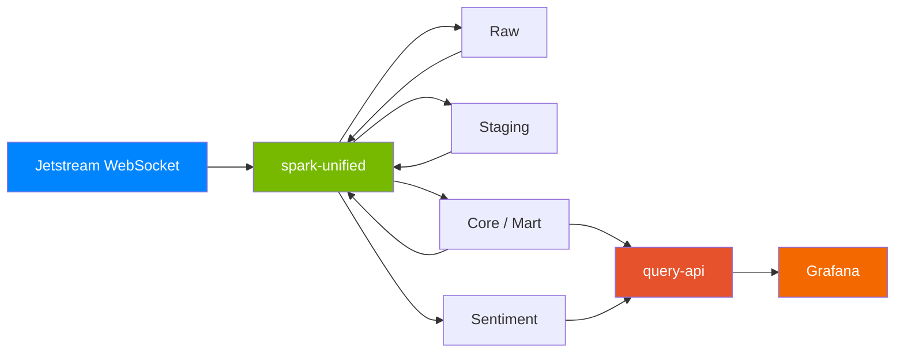

# Atmosphere

Real-time Bluesky social network analytics with multilingual sentiment analysis.

Ingests the full [Bluesky](https://bsky.app) firehose (~240 events/sec), transforms it through a four-layer medallion architecture, runs GPU-accelerated sentiment analysis, and surfaces live analytics through Grafana.

**"A lot with a little."** Spark handles ingestion, streaming, transformation, ML inference, and query serving. Iceberg stores it. Grafana displays it.

## Architecture



One unified Spark process running 5 streaming queries in a single JVM with 5-second micro-batch triggers, reading upstream Iceberg tables. A custom REST API (`query-api`) serves mart query results to Grafana via the Infinity datasource plugin. The entire stack fits in ~22 GB of RAM.

## Tech Stack

| Technology | Role |
|---|---|
| Apache Spark 4.x | Unified engine (ingest, stream, transform, ML) |
| Apache Iceberg | Table format (ACID, time travel) |
| FastAPI + PySpark | Custom REST API for query serving |
| Grafana + Infinity | Live dashboards with JSON datasource |
| RustFS | S3-compatible object storage |
| Apache Polaris | Iceberg REST catalog |
| XLM-RoBERTa | Multilingual sentiment model (100+ languages) |
| Docker Compose | Orchestration |
| Cloudflare Tunnel | Public access |

## Key Features

- **Custom DataSource V2** -- PySpark WebSocket source with reconnection, failover, and cursor rewind
- **Medallion architecture** -- Raw (JSON) -> Staging (6 typed tables) -> Core (enriched + extracted) -> Mart (aggregated analytics)
- **GPU sentiment analysis** -- XLM-RoBERTa baked into a CUDA container, batch inference via `mapInPandas`
- **Custom query API** -- FastAPI + PySpark REST service reading Iceberg tables, serving Grafana via Infinity datasource

## Project Structure

```
spark/
  unified.py                     # Consolidated entrypoint (all 5 queries)
  sources/jetstream_source.py    # Custom DataSource V2
  ingestion/ingest_raw.py        # Ingest layer
  transforms/
    staging.py                   # Staging layer
    core.py                      # Core + mart layer
    sentiment.py                 # GPU inference layer
    sql/                         # 6 staging + 4 core + 9 mart SQL transforms
  serving/query_api.py           # REST API for Grafana (FastAPI + PySpark)
grafana/                         # Provisioning configs + dashboard JSON
scripts/                         # Health monitor, maintenance, replay
infra/init/                      # S3 bucket + catalog bootstrap
docs/                            # TDD, TRD, BRD, Roadmap
```

## Quickstart

```bash
git clone https://github.com/joshlizana/atmosphere.git
cd atmosphere
cp .env.example .env
make up
```

The first build takes ~10 minutes (downloads Spark, Iceberg JARs, PyTorch, and the 1.1 GB sentiment model). Subsequent starts are instant.

Once running, open Grafana at [http://localhost:3000](http://localhost:3000) to see live analytics. Data begins flowing within 30 seconds of startup.

### Prerequisites

| Requirement | Notes |
|---|---|
| OS | Linux, macOS, or Windows + WSL2 |
| Docker | Compose V2 |
| NVIDIA GPU | + drivers + [nvidia-container-toolkit](https://docs.nvidia.com/datacenter/cloud-native/container-toolkit/latest/install-guide.html) |
| 32 GB RAM | ~24 GB reserved by stack |
| 30 GB disk | |
| `git`, `make` | |

### Commands

| Command | Description |
|---|---|
| `make up` | Build and start all services |
| `make down` | Stop and remove containers |
| `make logs` | Tail all logs |
| `make status` | Show container status |
| `make clean` | Full teardown (containers + volumes) |
| `make monitor` | Single health check |
| `make maintain` | Iceberg table maintenance |
| `make smoke-test` | Run acceptance test suite |

## Progress

| Milestone | Status |
|---|---|
| M1: Foundation | Done |
| M2: Ingestion | Done |
| M3: Staging | Done |
| M4: Core + Mart | Done |
| M5: Sentiment | Done |
| M6: Dashboard | In progress |
| M7: Public Access | Not started |
| M8: Hardening | Not started |

## Documentation

- [Technical Design Document](docs/TDD.md)
- [Technical Requirements Document](docs/TRD.md)
- [Business Requirements Document](docs/BRD.md)
- [Roadmap](docs/ROADMAP.md)
