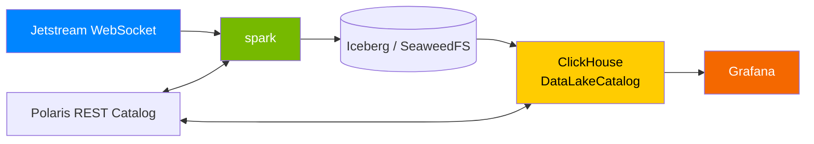

# Atmosphere

Real-time Bluesky social network analytics with multilingual sentiment analysis.

Ingests the full [Bluesky](https://bsky.app) firehose (~240 events/sec), transforms it through a four-layer medallion architecture, runs GPU-accelerated sentiment analysis, and surfaces live dashboards through Grafana.

**"A lot with a little."** Spark handles ingestion, streaming, transformation, and ML inference. Iceberg stores it. ClickHouse serves it. Grafana displays it.

## Architecture



One unified Spark process runs **16 streaming queries** in a single JVM with 5-second micro-batch triggers: ingest → staging (6 tables) → core (5 tables + pipeline-health view) → sentiment → 10 materialized marts. ClickHouse reads the Iceberg marts through Polaris via its `DataLakeCatalog` engine and serves Grafana over the native TCP datasource. The entire stack fits in ~22 GB of RAM.

## Current State

The project is **mid-migration** from a custom `query-api` (FastAPI + PySpark + Grafana Infinity) to ClickHouse for Grafana query serving:

- `clickhouse` service is live in `docker-compose.yml`; the init container provisions a Polaris reader principal and the `polaris_catalog` ClickHouse database.
- **Outstanding work:** Grafana datasource plugin swap, dashboard panel rewrites against ClickHouse, and smoke-test updates.

A Python monitor — **Heimdall** — is also in progress under `scripts/heimdall/`. It runs a decorator-based check registry organized in a three-layer gated model: L1 machine health → L2 operational fidelity (Spark streaming metrics via Dropwizard `/metrics/json`) → L3 data fidelity (deferred). Higher layers short-circuit when a lower layer breaches. State persists in a DuckDB `:memory:` store backed by a JSONL write-ahead log at `logs/heimdall-wal.jsonl`. L1+L2 (18 checks) is the current ship target; L3 data-quality + Iceberg-hygiene modules stay on disk until the DuckDB-embedded Iceberg reader lands in a follow-up.

Public dashboard access via Cloudflare Tunnel is a planned follow-on once the ClickHouse migration completes.

## Tech Stack

| Technology | Role |
|---|---|
| Apache Spark 4.x | Unified engine — ingest, stream, transform, ML inference |
| Apache Iceberg | Open table format on top of SeaweedFS (ACID, schema evolution, time travel) |
| Apache Polaris | Iceberg REST catalog |
| SeaweedFS | S3-compatible object storage |
| ClickHouse 26.1 | OLAP query serving via `DataLakeCatalog` engine |
| Grafana + `grafana-clickhouse-datasource` | Live dashboards over native TCP |
| XLM-RoBERTa | Multilingual sentiment model (100+ languages, baked into the Spark image) |
| Heimdall (Python) | Pipeline + data-quality + Iceberg health monitor |
| Docker Compose | Orchestration (8 services, ~22 GB total) |
| Cloudflare Tunnel | Public access (planned, post-ClickHouse) |

## Key Features

- **Custom DataSource V2** — PySpark WebSocket source with reconnection, failover, and cursor-based replay
- **Medallion architecture** — Raw (JSON) → Staging (6 typed tables) → Core (enriched + extracted) → Mart (10 materialized aggregates + 1 query-time view)
- **GPU sentiment analysis** — XLM-RoBERTa baked into a CUDA Spark image, batch inference via `mapInPandas`
- **Iceberg-native query serving** — ClickHouse reads Iceberg directly through Polaris, no Spark-driver-on-the-query-path
- **Heimdall monitor** — decorator-based Python check registry with a three-layer gated model (machine health → operational fidelity → data fidelity), DuckDB-in-memory state, and a crash-recoverable JSONL write-ahead log

## Project Structure

```
spark/
  unified.py                     # Consolidated entrypoint (all 16 queries)
  sources/jetstream_source.py    # Custom DataSource V2
  ingestion/ingest_raw.py        # Ingest layer
  transforms/
    staging.py                   # Staging layer (6 tables via foreachBatch)
    core.py                      # Core layer + pipeline_health view
    sentiment.py                 # GPU inference layer
    marts.py                     # 10 materialized streaming marts
    sql/                         # staging/, core/, mart/ SQL transforms + read_*.sql
  analysis/                      # Iceberg maintenance + sizing analysis
  Dockerfile.sentiment           # Sole Spark image (CUDA + Spark 4.x + baked model)
grafana/                         # Provisioning + dashboard JSON (ClickHouse-bound)
docker/clickhouse/               # ClickHouse image build context
infra/init/                      # Idempotent SeaweedFS + Polaris + ClickHouse bootstrap
docker/seaweedfs/                # SeaweedFS image build context (envsubst entrypoint)
scripts/
  heimdall/                      # Python monitor package
  reset-checkpoint.sh            # Wipe a layer's Spark checkpoint
  replay.sh                      # Replay Jetstream from a cursor
  smoke-test.sh                  # End-to-end acceptance suite
docs/                            # BRD, TDD, TRD, Roadmap, mart sizing analysis
```

## Quickstart

```bash
git clone https://github.com/joshlizana/atmosphere.git
cd atmosphere
cp .env.example .env
make up
```

The first build takes ~10 minutes (downloads Spark, Iceberg JARs, PyTorch, and the ~1.1 GB sentiment model). Subsequent starts are much faster.

Once running, open Grafana at [http://localhost:3000](http://localhost:3000). Data begins flowing within ~30 seconds of startup.

### Prerequisites

| Requirement | Notes |
|---|---|
| OS | Linux, macOS, or Windows + WSL2 |
| Docker | Compose V2 |
| NVIDIA GPU | + drivers + [nvidia-container-toolkit](https://docs.nvidia.com/datacenter/cloud-native/container-toolkit/latest/install-guide.html) (CPU fallback works for development) |
| 32 GB RAM | ~22 GB reserved by the stack, ~8 GB left for the host |
| 30 GB disk | |
| `git`, `make`, `python3` (with a local `.venv` for Heimdall) | |

### Commands

| Command | Description |
|---|---|
| `make up` | Build and start all services |
| `make down` | Stop containers (volumes preserved) |
| `make logs` | Tail all logs |
| `make status` | Show container status |
| `make clean` | Full teardown (containers + volumes) |
| `make smoke-test` | Run end-to-end acceptance suite (waits for data) |
| `make reset-checkpoint LAYER=<layer>` | Wipe a layer's Spark checkpoint state |
| `make replay TIME=<timestamp>` | Replay Jetstream from a cursor |
| `make heimdall` | Launch the Heimdall TUI (primary monitor interface) |
| `make heimdall-run` | One-shot Heimdall check cycle |
| `make heimdall-watch` | Headless Heimdall watch loop |

Heimdall targets run on the host from a local `.venv`, not inside a container.

## Progress

| Milestone | Status |
|---|---|
| M1: Foundation | Done |
| M2: Ingestion | Done |
| M3: Staging | Done |
| M4: Core + Mart | Done |
| M5: Sentiment | Done |
| M6: Dashboard / ClickHouse serving | In progress |
| M7: Public Access (Cloudflare Tunnel) | Planned |
| M8: Hardening + Heimdall monitor | In progress |

## Documentation

- [Business Requirements Document](docs/BRD.md)
- [Technical Design Document](docs/TDD.md)
- [Technical Requirements Document](docs/TRD.md)
- [Roadmap](docs/ROADMAP.md)
- [Mart sizing analysis](docs/mart-sizing-analysis.md)
