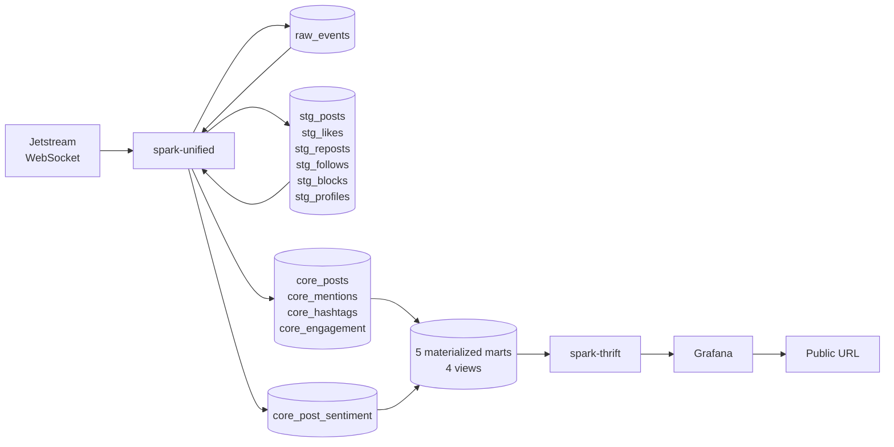
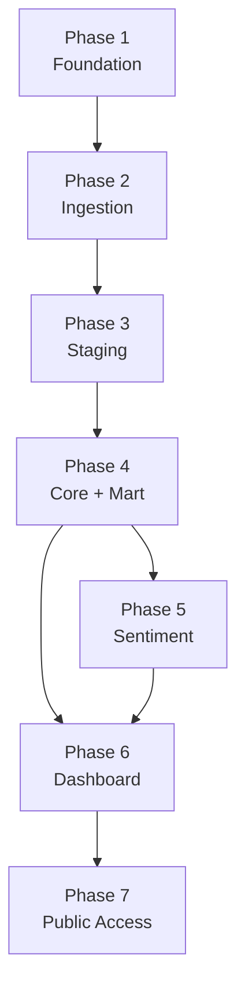

# Business Requirements Document
## Atmosphere

| | |
|---|---|
| **Author** | Joshua |
| **Status** | Draft |
| **Created** | 2026-04-11 |
| **Last updated** | 2026-04-11 |

---

## Table of Contents

1. [Executive Summary](#1-executive-summary)
2. [Business Case](#2-business-case)
3. [Stakeholder Analysis](#3-stakeholder-analysis)
4. [Objectives](#4-objectives)
5. [Scope](#5-scope)
6. [Requirements](#6-requirements)
7. [Assumptions and Dependencies](#7-assumptions-and-dependencies)
8. [Constraints](#8-constraints)
9. [Success Metrics](#9-success-metrics)
10. [Solution Approach](#10-solution-approach)
11. [Timeline](#11-timeline)
12. [Risk Assessment](#12-risk-assessment)
13. [Glossary](#13-glossary)

---

## 1. Executive Summary

Atmosphere is a real-time streaming analytics platform that ingests the full Bluesky social network firehose, enriches posts with multilingual sentiment analysis, and delivers live dashboards accessible via a public URL.

The platform processes approximately 240 events per second — posts, likes, reposts, follows, and blocks — through a four-layer medallion architecture. A GPU-accelerated transformer model scores every post for sentiment across 100+ languages. Five continuously updating dashboard sections surface sentiment trends, firehose throughput, language distribution, engagement velocity, trending hashtags, and pipeline health.

The distinguishing characteristic of Atmosphere is architectural consolidation. Apache Spark serves as the sole compute engine, handling ingestion, stream processing, transformation, ML inference, and query serving. Apache Iceberg provides the storage format. Grafana provides the visualization layer. Three technologies address twelve engineering concerns.

For comprehensive technical details — data model, container architecture, custom data source design, and ML pipeline — refer to the [Technical Design Document](TDD.md).

---

## 2. Business Case

### 2.1 Problem Statement

Social networks generate high-volume, multilingual event streams that require purpose-built infrastructure to capture, process, and analyze in real time. Building such a system typically demands expertise across many specialized tools — message brokers, stream processors, orchestrators, transformation frameworks, ML serving layers, and dashboard platforms.

Atmosphere addresses the question: **how much analytical capability can a single platform deliver?**

### 2.2 Strategic Alignment

Atmosphere demonstrates three capabilities valued in data engineering roles:

| Capability | How Atmosphere Demonstrates It |
|---|---|
| **Streaming architecture design** | End-to-end ownership of a real-time pipeline from WebSocket ingestion through dashboard delivery, with sub-10-second latency across five chained Spark Structured Streaming applications |
| **Platform depth** | Mastery of a single platform (Spark) across seven distinct roles — ingestion, streaming, SQL transformation, scheduling, data quality, ML inference, and query serving — showing the ability to maximize value from existing infrastructure |
| **Applied ML in data engineering** | GPU-accelerated multilingual sentiment analysis (XLM-RoBERTa, 100+ languages) integrated into a streaming pipeline via `mapInPandas`, bridging data engineering and ML engineering |

### 2.3 Expected Outcomes

| Outcome | Measure |
|---|---|
| Live public dashboard | A URL accessible to anyone showing real-time Bluesky analytics with 5-second refresh |
| End-to-end streaming pipeline | Data flows from Jetstream WebSocket to Grafana dashboard within 10 seconds |
| Multilingual sentiment analysis | Every post scored for sentiment — English, Japanese, Korean, Spanish, German, and 95+ additional languages |
| Reproducible environment | Any engineer can clone the repository and run `make up` to start the full 8-container stack |

---

## 3. Stakeholder Analysis

| Stakeholder | Interest | Role |
|---|---|---|
| **Hiring managers** | Evaluate data engineering, streaming, and ML integration skills through a working system with live data | Primary reviewer |
| **Technical interviewers** | Assess architectural decisions, code quality, and understanding of Spark internals via the codebase and TDD | Technical reviewer |
| **Peer engineers** | Understand design trade-offs, learn from the custom DataSource V2 implementation and GPU inference integration | Collaborator |
| **Portfolio visitors** | Experience a live, interactive dashboard showing real-time social network activity | End user |

### 3.1 What Each Stakeholder Evaluates

**Hiring managers** look for evidence of:
- Ability to scope, design, and deliver a complete system end-to-end
- Structured documentation — this BRD defines _why_ and _what_; the TDD defines _how_
- A working artifact they can interact with — the live public dashboard

**Technical interviewers** look for evidence of:
- Spark depth — a custom DataSource V2 streaming source implemented entirely in Python, with offset tracking, checkpoint integration, and micro-batch boundary management
- Architectural reasoning — documented rationale for each design decision (TDD §15)
- Clean, well-organized code with SQL transformations in standalone files

**Peer engineers** look for:
- Reproducibility — `git clone` followed by `make up` produces a working system
- Interesting technical patterns — custom Spark sources, GPU-accelerated `mapInPandas`, chained streaming queries across Iceberg tables
- Honest documentation of trade-offs and scope boundaries

---

## 4. Objectives

Each objective follows SMART criteria (specific, measurable, achievable, relevant, time-bound).

| # | Objective | Measure of Success |
|---|---|---|
| O1 | Ingest the full Bluesky Jetstream firehose in real time | Sustained ingestion of ~240 events/sec across all collections with gapless cursor-based recovery on disconnect |
| O2 | Process events through a four-layer medallion architecture | `atmosphere.raw`, `atmosphere.staging`, `atmosphere.core`, and `atmosphere.mart` namespaces populated continuously with 5-second micro-batch cadence |
| O3 | Score every post for multilingual sentiment | `core_post_sentiment` table contains a sentiment label (`positive`, `negative`, `neutral`) and confidence score for every row in `core_posts` |
| O4 | Deliver live analytics through a Grafana dashboard | Five dashboard sections — sentiment, firehose activity, language/content, engagement velocity, pipeline health — refreshing every 5 seconds |
| O5 | Expose the dashboard via a public URL | Dashboard accessible at `atmosphere.yourdomain.com` via Cloudflare Tunnel with outbound-only HTTPS |
| O6 | Provide a single-command reproducible environment | `make up` starts the full 8-container stack (init, rustfs, polaris, postgres, spark-unified, spark-thrift, grafana, cloudflared) from a clean clone |

---

## 5. Scope

### 5.1 In Scope

| Area | Detail |
|---|---|
| Data ingestion | All Bluesky Jetstream event types: posts, likes, reposts, follows, blocks, profile updates (~240 events/sec, ~20.7M/day) |
| Custom data source | PySpark DataSource V2 implementation wrapping the Jetstream WebSocket with offset tracking and checkpoint integration |
| Stream processing | Five chained Spark Structured Streaming applications across four medallion layers, each running in its own container |
| Sentiment analysis | GPU-accelerated XLM-RoBERTa inference on all posts via `mapInPandas`, with automatic CPU adaptation |
| Data storage | 20+ Apache Iceberg tables on RustFS (S3-compatible storage) with Polaris REST catalog |
| Dashboard | Five-section Grafana dashboard (17+ panels) provisioned as code with Apache Hive datasource plugin |
| Public access | Cloudflare Tunnel from local machine to public HTTPS URL |
| Infrastructure | Docker Compose orchestration within a ~22 GB memory budget on a 32 GB workstation |
| Documentation | BRD (this document), TDD, README |

### 5.2 Scope Boundaries

| Area | Boundary |
|---|---|
| Deployment | Single-node local deployment via Docker Compose on a 32 GB workstation |
| Analytics | Aggregate network-level analytics — firehose throughput, sentiment distribution, engagement rates, trending hashtags |
| Data | Publicly available Bluesky data via the Jetstream WebSocket |
| History | Live events from the current stream forward; 30-day retention window with depth growing organically |
| Schema enforcement | Inline Spark transformations at the staging layer |
| Testing | Informal validation and pipeline self-monitoring during initial development; formal test suites in a later phase |

---

## 6. Requirements

### 6.1 Functional Requirements

| ID | Priority | Requirement |
|---|---|---|
| FR-01 | Critical | The system ingests all event types from the Bluesky Jetstream WebSocket (~240 events/sec) via a custom PySpark DataSource V2 source |
| FR-02 | Critical | Raw events are preserved verbatim as JSON in `atmosphere.raw.raw_events`, partitioned by `days(ingested_at)` and `collection` |
| FR-03 | Critical | Events are parsed by collection type into six typed staging tables: `stg_posts`, `stg_likes`, `stg_reposts`, `stg_follows`, `stg_blocks`, `stg_profiles` |
| FR-04 | Critical | Posts are enriched in the core layer with extracted hashtags, mention DIDs, link URLs, primary language, and content type classification |
| FR-05 | Critical | Every post receives a three-class sentiment score (`positive`, `negative`, `neutral`) from the XLM-RoBERTa model via GPU-accelerated `mapInPandas` |
| FR-06 | Critical | Five materialized mart tables (`mart_sentiment_timeseries`, `mart_events_per_second`, `mart_trending_hashtags`, `mart_engagement_velocity`, `mart_pipeline_health`) are updated on each 5-second micro-batch |
| FR-07 | Critical | The Grafana dashboard displays five analytical rows with sub-second query latency via Spark Thrift Server |
| FR-08 | Critical | The pipeline recovers automatically from WebSocket disconnects using exponential backoff and cursor-based replay |
| FR-09 | High | Trending hashtags are identified by comparing current frequency against a historical baseline, with window sizes configurable via Grafana template variables |
| FR-10 | High | The dashboard is publicly accessible via Cloudflare Tunnel at a custom domain |
| FR-11 | High | The full stack starts from `make up` with idempotent initialization (init container creates RustFS buckets, Polaris warehouse, and Iceberg namespaces) |
| FR-12 | Medium | Dashboard panels display the top 5 most positive and most negative recent posts with full text via the `mart_top_posts` view |
| FR-13 | Medium | The pipeline health row shows per-container processing lag, events ingested per second, and last successful batch timestamps |
| FR-14 | Medium | Four additional analytics views (`mart_language_distribution`, `mart_top_posts`, `mart_most_mentioned`, `mart_content_breakdown`) are served on-demand through Spark Thrift |

### 6.2 Non-Functional Requirements

| ID | Category | Requirement |
|---|---|---|
| NFR-01 | Latency | End-to-end latency from Jetstream event to dashboard display is under 10 seconds |
| NFR-02 | Throughput | The pipeline sustains 240+ events/sec ingestion; the sentiment model processes ~26 posts/sec at batch_size=64 on GPU with substantial headroom |
| NFR-03 | Resilience | All long-running containers restart automatically (`restart: unless-stopped`); WebSocket disconnects recover with gapless cursor replay within Jetstream's 24-hour retention |
| NFR-04 | Resource efficiency | The unified stack operates within ~22 GB on a 32 GB workstation, leaving ~8 GB for the host and ~1.7 GB headroom |
| NFR-05 | Reproducibility | The environment is fully defined in version-controlled `docker-compose.yml`, `Makefile`, and `.env.example` |
| NFR-06 | Observability | Pipeline health is self-monitored via `mart_pipeline_health` and a dedicated Grafana dashboard row |
| NFR-07 | Portability | Sentiment inference adapts automatically between GPU (`device=0`) and CPU (`device=-1`) at container startup via `torch.cuda.is_available()` |
| NFR-08 | Graceful degradation | Grafana displays last known data when any upstream container falls behind; dashboard panels show stale timestamps rather than empty panels |

### 6.3 Integration Requirements

| ID | Requirement |
|---|---|
| IR-01 | spark-unified connects to the Jetstream WebSocket via a custom Python DataSource V2 implementation (`JetstreamDataSource` + `JetstreamStreamReader`) |
| IR-02 | spark-unified and spark-thrift share table metadata through the Polaris REST catalog at port 8181 |
| IR-03 | Grafana connects to Spark Thrift Server via the Apache Hive datasource plugin (JDBC, port 10000) |
| IR-04 | The cloudflared container routes public HTTPS traffic to the local Grafana instance on the `atmosphere-frontend` Docker network |
| IR-05 | spark-unified accesses the host NVIDIA GPU via `nvidia-container-toolkit` with `deploy.resources.reservations.devices: [capabilities: [gpu]]` |

---

## 7. Assumptions and Dependencies

### 7.1 Assumptions

| ID | Assumption | Risk if Invalid |
|---|---|---|
| A-01 | Bluesky Jetstream public endpoints (`jetstream[1-2].us-[east\|west].bsky.network`) remain available | Medium — four instances provide redundancy; Jetstream is open-source and self-hostable from the official Docker image |
| A-02 | Jetstream event volume remains in the 100–1,000 events/sec range | Low — at observed ~240 events/sec the pipeline uses ~5% of the server's 5,000 events/sec subscriber cap; Spark handles volume increases with container memory tuning |
| A-03 | The AT Protocol collection schemas (post, like, repost, follow, block) remain stable | Low — the staging layer isolates downstream tables from raw format changes; schema evolution is handled at the staging boundary |
| A-04 | The cardiffnlp/twitter-xlm-roberta-base-sentiment model remains available on HuggingFace | Low — the model is baked into the Docker image at build time; once built, the image is self-contained |
| A-05 | The host machine has an NVIDIA GPU with CUDA support and nvidia-container-toolkit installed | Medium — the pipeline adapts to CPU inference automatically, with reduced throughput (~5-15 texts/sec vs. 200-500 texts/sec on GPU) |

### 7.2 Dependencies

| ID | Dependency | Type | Detail |
|---|---|---|---|
| D-01 | Bluesky Jetstream WebSocket | External service | `wss://jetstream2.us-east.bsky.network/subscribe` — public, unauthenticated, rate-limit-free |
| D-02 | Apache Spark 4.x | Open-source software | Built-in Iceberg support, Python DataSource V2 API |
| D-03 | cardiffnlp/twitter-xlm-roberta-base-sentiment | Open-source ML model | ~1.1 GB, fine-tuned on ~198M tweets, 100+ languages |
| D-04 | NVIDIA GPU + nvidia-container-toolkit | Host hardware/software | Required for GPU inference; CPU fallback available |
| D-05 | Cloudflare account + registered domain | External service | ~$10/year domain + free Cloudflare plan for tunnel |
| D-06 | Docker Engine + Docker Compose | Host software | Container orchestration for the 8-container stack |

---

## 8. Constraints

| ID | Category | Constraint |
|---|---|---|
| C-01 | Hardware | 32 GB RAM workstation with NVIDIA GPU, running WSL2 on Linux 5.15 |
| C-02 | Compute | ~24 GB allocated to Docker; ~8 GB reserved for the host workstation |
| C-03 | Memory budget | Unified architecture: spark-unified (14 GB), rustfs (3 GB), spark-thrift (2 GB), polaris (1 GB), postgres (1 GB), grafana (512 MB), init (512 MB), cloudflared (256 MB) — total ~22.3 GB |
| C-04 | Storage | All data stored locally in RustFS within Docker volumes; 30-day retention window |
| C-05 | Network | Single outbound WebSocket to Jetstream; inbound public access via Cloudflare Tunnel |
| C-06 | Technology | Three core technologies — Spark, Iceberg, Grafana — plus supporting infrastructure (RustFS, Polaris, PostgreSQL, cloudflared) |
| C-07 | Networking | Two Docker networks: `atmosphere-data` (internal compute/storage) and `atmosphere-frontend` (serving/public access) |

---

## 9. Success Metrics

### 9.1 Key Performance Indicators

| KPI | Target | Measurement Method |
|---|---|---|
| Ingestion throughput | ~240 events/sec sustained | `mart_pipeline_health` — events ingested per second |
| End-to-end latency | < 10 seconds | `mart_pipeline_health` — delta between event `time_us` and dashboard query time |
| Sentiment coverage | 100% of posts scored | Row count: `core_post_sentiment` matches `core_posts` |
| Dashboard availability | Available during all pipeline runtime | Grafana `/api/health` endpoint |
| Cold start time | Full stack operational within 5 minutes of `make up` | Time from `make up` to first Grafana panel rendering data |
| Language coverage | Sentiment scores across all observed languages | Spot-check labels for Japanese (~26% of posts), Korean, Spanish, German |

### 9.2 Acceptance Criteria

The project is complete when:

1. **The pipeline runs continuously** — all containers healthy, data flowing through all four medallion layers (`atmosphere.raw` → `atmosphere.staging` → `atmosphere.core` → `atmosphere.mart`)
2. **The dashboard is live** — five sections rendering real-time data with 5-second refresh via Spark Thrift JDBC
3. **Sentiment analysis is active** — every post receives a multilingual sentiment score with visible positive/negative/neutral distribution on the Sentiment Live Feed row
4. **The public URL is accessible** — `atmosphere.yourdomain.com` loads the Grafana dashboard through Cloudflare Tunnel
5. **The environment is reproducible** — `git clone` followed by `make up` produces a working system
6. **Documentation is complete** — BRD, TDD, and README are published and internally consistent

---

## 10. Solution Approach

### 10.1 Architecture Summary

| Technology | Responsibilities |
|---|---|
| **Apache Spark 4.x** | WebSocket ingestion (custom DataSource V2), stream processing (Structured Streaming, 5-second micro-batches), SQL transformation, ML inference (`mapInPandas` with GPU), query serving (Thrift Server) |
| **Apache Iceberg** | ACID table format across four medallion layers — `atmosphere.raw`, `atmosphere.staging`, `atmosphere.core`, `atmosphere.mart` — on RustFS with Polaris REST catalog |
| **Grafana** | Live dashboard with five analytical sections, provisioned as code, connected via Apache Hive datasource plugin to Spark Thrift JDBC |

### 10.2 Data Flow

Five Spark Structured Streaming applications run in separate containers, chained via Iceberg `readStream`. Each application processes 5-second micro-batches. Spark Thrift Server exposes all tables via JDBC for Grafana queries.

### 10.3 Key Technical Differentiators

| Component | What It Demonstrates |
|---|---|
| **Custom PySpark DataSource V2** | Deep Spark internals — implementing the streaming source contract (`initialOffset`, `read`, `commit`, `schema`) entirely in Python, with dual offset tracking (Spark checkpoint + Jetstream cursor) |
| **GPU-accelerated `mapInPandas`** | ML engineering integrated into a data pipeline — vectorized batch inference at batch_size=64 with automatic GPU/CPU adaptation, processing ~200-500 texts/sec on GPU |
| **Five chained streaming queries** | Production streaming architecture — independent applications coordinated through Iceberg table state, each with its own lifecycle, memory allocation, and checkpoint |
| **Cloudflare Tunnel** | Infrastructure design — all compute stays local; only rendered dashboard HTML traverses the tunnel to a public URL |

---

## 11. Timeline

### 11.1 Phases

| Phase | Deliverables | Dependencies |
|---|---|---|
| **Phase 1: Foundation** | `docker-compose.yml` with infrastructure containers (RustFS, Polaris, PostgreSQL). Init container creates `warehouse` bucket, `atmosphere` catalog, and four Iceberg namespaces. | — |
| **Phase 2: Ingestion** | Custom `JetstreamDataSource` + `JetstreamStreamReader` (Python DataSource V2). Ingest layer writing `raw_events` to `atmosphere.raw` with dual offset tracking. | Phase 1 |
| **Phase 3: Staging** | Staging layer parsing all six collection types into typed staging tables with daily partitioning. | Phase 2 |
| **Phase 4: Core + Mart** | Core layer producing five enriched core tables (`core_posts`, `core_mentions`, `core_hashtags`, `core_engagement`) and five materialized mart tables. Four analytics views. | Phase 3 |
| **Phase 5: Sentiment** | Sentiment layer running XLM-RoBERTa inference on GPU via `mapInPandas` (batch_size=64). Docker image with CUDA + embedded model weights (~1.1 GB). `core_post_sentiment` table. All four layers consolidated into spark-unified. | Phase 4 |
| **Phase 6: Dashboard** | Grafana with five provisioned dashboard sections (17+ panels). spark-thrift serving JDBC queries via Apache Hive plugin. | Phase 4 (Phase 5 for sentiment panels) |
| **Phase 7: Public Access** | cloudflared container, Cloudflare Tunnel configuration, public URL. README and documentation finalized. | Phase 6 |

### 11.2 Phase Dependencies

---

## 12. Risk Assessment

| ID | Risk | Likelihood | Impact | Mitigation |
|---|---|---|---|---|
| R-01 | Jetstream public endpoints become unavailable | Low | High | Four public instances across US-East and US-West provide redundancy. Jetstream is open-source (Go); self-hosting from the official Docker image is a documented fallback. |
| R-02 | Event volume spikes beyond pipeline capacity | Low | Medium | At ~240 events/sec the pipeline operates well within the server's 5,000 events/sec subscriber cap. Spark container memory is configurable; the 50,000-event buffer in the custom data source provides backpressure. |
| R-03 | GPU becomes unavailable | Medium | Low | The pipeline adapts automatically to CPU inference at startup. Throughput decreases (~5-15 texts/sec vs. ~200-500 on GPU) but the pipeline continues operating. |
| R-04 | Spark 4.x Python DataSource V2 API has undocumented limitations | Medium | Medium | The custom source is isolated in a single file (`jetstream_source.py`). The API is stable as of Spark 4.x GA. Changes are contained to one component. |
| R-05 | Iceberg streaming reads introduce latency between layers | Low | Medium | Each layer operates independently with its own checkpoint. Latency between layers is visible in the `mart_pipeline_health` table and the Pipeline Health dashboard row. |
| R-06 | XLM-RoBERTa produces low-quality sentiment for underrepresented languages | Medium | Low | The model covers 100+ languages but accuracy varies by language. The dashboard displays sentiment distribution, making quality visible. The model can be swapped via a single configuration change in the Dockerfile. |
| R-07 | Docker Compose resource contention on 32 GB machine | Low | Medium | Memory allocations are pre-budgeted per container (~22 GB total), leaving ~8 GB for the host and ~1.7 GB headroom. The unified architecture consolidates 4 Spark containers into 1, saving ~3 GB JVM overhead. |

---

## 13. Glossary

| Term | Definition |
|---|---|
| **AT Protocol** | The Authenticated Transfer Protocol — the decentralized social networking protocol underlying Bluesky |
| **Bluesky** | A decentralized social network built on the AT Protocol |
| **BRD** | Business Requirements Document — this document; defines the project's objectives, scope, requirements, and success criteria |
| **Collection** | A named set of records within an AT Protocol user repository, identified by an NSID (e.g., `app.bsky.feed.post`) |
| **DataSource V2** | Spark's provider API for implementing custom data sources with full streaming support (offset tracking, checkpointing) |
| **DID** | Decentralized Identifier — a globally unique, persistent identifier for a user account in the AT Protocol |
| **Iceberg** | Apache Iceberg — an open table format providing ACID transactions, schema evolution, and time travel |
| **Jetstream** | A service that converts the AT Protocol's binary CBOR firehose into lightweight JSON events delivered over WebSocket |
| **mapInPandas** | A Spark API that applies a Python function to batches of rows as Pandas DataFrames, enabling vectorized batch ML inference |
| **Medallion architecture** | A data organization pattern with progressively refined layers: raw, staging, core, mart |
| **Polaris** | Apache Polaris — an open-source Iceberg REST catalog for multi-engine metadata management |
| **RustFS** | An Apache 2.0-licensed, S3-API-compatible object storage server |
| **Structured Streaming** | Spark's stream processing engine that treats live data streams as continuously appended tables |
| **TDD** | Technical Design Document — the companion document covering implementation details, data model, and system architecture |
| **Thrift Server** | Spark's built-in HiveServer2-compatible JDBC endpoint for SQL query serving |
| **XLM-RoBERTa** | A cross-lingual transformer model trained on 100+ languages, used for multilingual sentiment classification |
