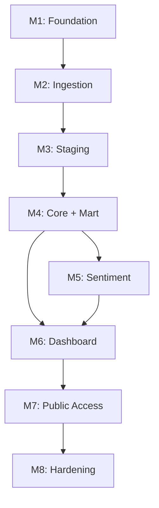

# Roadmap
## Atmosphere

| | |
|---|---|
| **Author** | Joshua |
| **Status** | Draft |
| **Created** | 2026-04-11 |
| **Last updated** | 2026-04-11 |

---

## Table of Contents

1. [Overview](#1-overview)
2. [Milestone Map](#2-milestone-map)
3. [M1: Foundation](#3-m1-foundation)
4. [M2: Ingestion](#4-m2-ingestion)
5. [M3: Staging](#5-m3-staging)
6. [M4: Core + Mart](#6-m4-core--mart)
7. [M5: Sentiment](#7-m5-sentiment)
8. [M6: Dashboard](#8-m6-dashboard)
9. [M7: Public Access](#9-m7-public-access)
10. [M8: Hardening](#10-m8-hardening)
11. [Requirement Traceability](#11-requirement-traceability)

---

## 1. Overview

This roadmap decomposes the Atmosphere platform into 8 milestones, each containing components and granular tasks. The structure follows the phase dependencies defined in the [BRD](BRD.md) §11, with requirements traced to the [TRD](TRD.md) and implementation details referenced from the [TDD](TDD.md).

**Hierarchy:** Milestone → Component → Task

**Milestone completion criteria:** Each milestone ends with a checkpoint — a concrete verification step confirming the milestone deliverables are operational before downstream work begins.

---

## 2. Milestone Map



| Milestone | Summary | Key Deliverables |
|---|---|---|
| **M1: Foundation** | Infrastructure containers, storage, catalog, namespaces | docker-compose.yml, init container, RustFS, Polaris, PostgreSQL |
| **M2: Ingestion** | Custom WebSocket data source, raw event capture | JetstreamDataSource, ingest layer, raw_events table |
| **M3: Staging** | Collection parsing, typed staging tables | Staging layer, 6 staging tables |
| **M4: Core + Mart** | Enrichment, extraction, aggregation | Core layer, 4 core tables, 5 mart tables, 4 views |
| **M5: Sentiment** | GPU-accelerated ML inference | Sentiment layer, core_post_sentiment. All 4 layers consolidated into spark-unified |
| **M6: Dashboard** | Grafana with 5 analytical sections | query-api, Grafana provisioning, 17+ panels |
| **M7: Public Access** | Cloudflare Tunnel, public URL | cloudflared container, domain configuration |
| **M8: Hardening** | Retention, monitoring validation, documentation | Data lifecycle, smoke tests, final documentation |

---

## 3. M1: Foundation

**Objective:** Stand up the infrastructure layer — storage, catalog, and initialization — so that Spark applications have a working Iceberg environment to write into.

**Requirements addressed:** FR-23, FR-24, FR-25, FR-26, NFR-09, NFR-10

### Component 1.1: Project Scaffolding

| # | Task | Output |
|---|---|---|
| 1.1.1 | Create `pyproject.toml` with uv for Python dependency management | `pyproject.toml`, `uv.lock` |
| 1.1.2 | Create `.env.example` with all required environment variables (RustFS credentials, Polaris URL, tunnel token placeholder) | `.env.example` |
| 1.1.3 | Create `.gitignore` (Python, Docker, IDE, .env) | `.gitignore` |
| 1.1.4 | Create `Makefile` with targets: `up`, `down`, `logs`, `status`, `clean` | `Makefile` |

### Component 1.2: Docker Compose — Infrastructure Services

| # | Task | Output |
|---|---|---|
| 1.2.1 | Define `rustfs` service (16 GB, ports 9000/9001, `rustfs-data` volume, health check) | `docker-compose.yml` |
| 1.2.2 | Define `postgres` service (2 GB, port 5432, `postgres-data` volume, `pg_isready` health check) | `docker-compose.yml` |
| 1.2.3 | Define `polaris` service (2 GB, port 8181, depends_on postgres, health check on `/api/v1/config`) | `docker-compose.yml` |
| 1.2.4 | Define `atmosphere-data` Docker network | `docker-compose.yml` |
| 1.2.5 | Define `atmosphere-frontend` Docker network | `docker-compose.yml` |

### Component 1.3: Init Container

| # | Task | Output |
|---|---|---|
| 1.3.1 | Write `infra/init/Dockerfile` (Python image with boto3 + requests) | `infra/init/Dockerfile` |
| 1.3.2 | Write `infra/init/setup.py` — create `warehouse` bucket in RustFS via S3 API | `infra/init/setup.py` |
| 1.3.3 | Add Polaris warehouse registration (`atmosphere`) to `setup.py` | `infra/init/setup.py` |
| 1.3.4 | Add Iceberg namespace creation (`atmosphere.raw`, `atmosphere.staging`, `atmosphere.core`, `atmosphere.mart`) to `setup.py` | `infra/init/setup.py` |
| 1.3.5 | Implement idempotent checks — skip creation if bucket/warehouse/namespace already exists | `infra/init/setup.py` |
| 1.3.6 | Define `init` service in Compose (1 GB, depends_on rustfs + polaris, `restart: "no"`) | `docker-compose.yml` |

### Component 1.4: Spark Base Image

| # | Task | Output |
|---|---|---|
| 1.4.1 | Write `spark/Dockerfile` — Spark 4.x base image with Python 3.11 | `spark/Dockerfile` |
| 1.4.2 | Add Iceberg + Polaris catalog JARs and S3/RustFS connector to the image | `spark/Dockerfile` |
| 1.4.3 | Write `spark/conf/spark-defaults.conf` — Iceberg catalog config, S3 endpoint, checkpoint directory | `spark/conf/spark-defaults.conf` |

### Checkpoint: M1 Complete

```
docker compose up -d
docker compose ps          → rustfs, polaris, postgres healthy; init exited(0)
# Verify via Polaris API:
curl http://localhost:8181/api/v1/config   → 200 OK
# Verify namespaces exist in Polaris catalog
```

---

## 4. M2: Ingestion

**Objective:** Build the custom PySpark DataSource V2 that wraps the Jetstream WebSocket and deploy the ingest layer to write raw events into Iceberg.

**Requirements addressed:** FR-01, FR-02, FR-03, FR-04, NFR-01, NFR-02, NFR-06

### Component 2.1: Custom WebSocket Data Source

| # | Task | Output |
|---|---|---|
| 2.1.1 | Implement `JetstreamDataSource(DataSource)` — register as a named Spark data source with `schema()` returning the `raw_events` schema | `spark/sources/jetstream_source.py` |
| 2.1.2 | Implement `JetstreamStreamReader(SimpleStreamReader)` — WebSocket connection to `wss://jetstream2.us-east.bsky.network/subscribe` | `spark/sources/jetstream_source.py` |
| 2.1.3 | Implement `initialOffset()` — return current time in microseconds | `spark/sources/jetstream_source.py` |
| 2.1.4 | Implement `read(start)` — drain event buffer, return `(rows, offset)` with latest `time_us` as new offset | `spark/sources/jetstream_source.py` |
| 2.1.5 | Implement `commit(end)` — persist offset for cursor-based reconnection | `spark/sources/jetstream_source.py` |
| 2.1.6 | Implement in-memory event buffer (bounded, configurable, default 50,000 events) | `spark/sources/jetstream_source.py` |
| 2.1.7 | Implement reconnection logic — exponential backoff (1s → 30s cap), cursor replay with `?cursor={last_time_us - 5_000_000}` | `spark/sources/jetstream_source.py` |
| 2.1.8 | Implement server failover — rotate through Jetstream public instances on repeated failure | `spark/sources/jetstream_source.py` |
| 2.1.9 | Implement malformed JSON handling — log and skip bad events | `spark/sources/jetstream_source.py` |

### Component 2.2: Ingest Layer Application

| # | Task | Output |
|---|---|---|
| 2.2.1 | Write `spark/ingestion/ingest_raw.py` — Structured Streaming job reading from `JetstreamDataSource` | `spark/ingestion/ingest_raw.py` |
| 2.2.2 | Configure `trigger(processingTime="5 seconds")` micro-batch trigger | `spark/ingestion/ingest_raw.py` |
| 2.2.3 | Create `atmosphere.raw.raw_events` table on first write (`CREATE TABLE IF NOT EXISTS`) with partition scheme `days(ingested_at), collection` and sort order `ingested_at ASC` | `spark/ingestion/ingest_raw.py` |
| 2.2.4 | Configure Spark checkpoint to `spark-checkpoints/ingest-raw/` subdirectory | `spark/ingestion/ingest_raw.py` |
| 2.2.5 | Define ingest layer in spark-unified service (14 GB, port 4040, depends_on init, `restart: unless-stopped`) | `docker-compose.yml` |

### Checkpoint: M2 Complete

```
# Verify raw events flowing:
SELECT COUNT(*) FROM atmosphere.raw.raw_events
  WHERE ingested_at > current_timestamp - INTERVAL 1 MINUTE;
# → Row count increasing steadily

# Verify throughput:
# mart_pipeline_health not yet available — check Spark UI at :4040
# → ~240 events/sec sustained
```

---

## 5. M3: Staging

**Objective:** Parse raw JSON events by collection type into six typed staging tables with correct column types and daily partitioning.

**Requirements addressed:** FR-05, NFR-15

### Component 3.1: Staging SQL Transforms

| # | Task | Output |
|---|---|---|
| 3.1.1 | Write SQL for `stg_posts` — extract `text`, `created_at`, `langs`, `has_embed`, `embed_type`, `is_reply`, `reply_root_uri`, `reply_parent_uri`, `facets_json`, `labels_json`, `tags` from raw JSON | `spark/transforms/sql/staging/stg_posts.sql` |
| 3.1.2 | Write SQL for `stg_likes` — extract `subject_uri`, `subject_cid`, `created_at`, `has_via` | `spark/transforms/sql/staging/stg_likes.sql` |
| 3.1.3 | Write SQL for `stg_reposts` — extract `subject_uri`, `subject_cid`, `created_at` | `spark/transforms/sql/staging/stg_reposts.sql` |
| 3.1.4 | Write SQL for `stg_follows` — extract `subject_did`, `created_at` | `spark/transforms/sql/staging/stg_follows.sql` |
| 3.1.5 | Write SQL for `stg_blocks` — extract `subject_did`, `created_at` | `spark/transforms/sql/staging/stg_blocks.sql` |
| 3.1.6 | Write SQL for `stg_profiles` — extract `display_name`, `description` | `spark/transforms/sql/staging/stg_profiles.sql` |

### Component 3.2: Staging Layer Application

| # | Task | Output |
|---|---|---|
| 3.2.1 | Write `spark/transforms/staging.py` — Structured Streaming job reading `atmosphere.raw.raw_events` via Iceberg `readStream` | `spark/transforms/staging.py` |
| 3.2.2 | Route events by `collection` field to the appropriate staging SQL transform | `spark/transforms/staging.py` |
| 3.2.3 | Derive `event_time` from `time_us`: `TIMESTAMP(time_us / 1000000)` | `spark/transforms/staging.py` |
| 3.2.4 | Create all six staging tables on first write with partition scheme `days(event_time)` and sort order `event_time ASC` | `spark/transforms/staging.py` |
| 3.2.5 | Configure checkpoint to `spark-checkpoints/staging/` subdirectory | `spark/transforms/staging.py` |
| 3.2.6 | Define staging layer in spark-unified service | `docker-compose.yml` |

### Checkpoint: M3 Complete

```
# Verify all six staging tables receive data:
SELECT 'stg_posts' AS tbl, COUNT(*) AS cnt FROM atmosphere.staging.stg_posts
UNION ALL SELECT 'stg_likes', COUNT(*) FROM atmosphere.staging.stg_likes
UNION ALL SELECT 'stg_reposts', COUNT(*) FROM atmosphere.staging.stg_reposts
UNION ALL SELECT 'stg_follows', COUNT(*) FROM atmosphere.staging.stg_follows
UNION ALL SELECT 'stg_blocks', COUNT(*) FROM atmosphere.staging.stg_blocks
UNION ALL SELECT 'stg_profiles', COUNT(*) FROM atmosphere.staging.stg_profiles;
# → All tables have rows; distribution matches expected collection shares

# Spot-check type correctness:
SELECT text, created_at, langs, embed_type FROM atmosphere.staging.stg_posts LIMIT 5;
# → Correct types, non-null values where expected
```

---

## 6. M4: Core + Mart

**Objective:** Enrich staging data into analytical core tables, extract mentions and hashtags, unify engagement events, and materialize mart-layer aggregations for dashboard queries.

**Requirements addressed:** FR-06, FR-07, FR-08, FR-09, FR-15, FR-16, FR-17, FR-18

### Component 4.1: Core SQL Transforms

| # | Task | Output |
|---|---|---|
| 4.1.1 | Write SQL for `core_posts` — extract hashtags from facets and tags field, extract mention DIDs from facets, extract link URLs from facets, derive `primary_lang` (first lang or `unknown`), classify `content_type` (`original`, `reply`, `quote`, `media_post`), compute `char_count` | `spark/transforms/sql/core/core_posts.sql` |
| 4.1.2 | Write SQL for `core_mentions` — explode mention DIDs from `core_posts.mention_dids` into `author_did`, `mentioned_did`, `post_rkey`, `event_time` rows | `spark/transforms/sql/core/core_mentions.sql` |
| 4.1.3 | Write SQL for `core_hashtags` — explode hashtags from `core_posts.hashtags` into `tag`, `author_did`, `post_rkey`, `event_time` rows | `spark/transforms/sql/core/core_hashtags.sql` |
| 4.1.4 | Write SQL for `core_engagement` — union `stg_likes` and `stg_reposts` into `event_type`, `actor_did`, `subject_uri`, `event_time` | `spark/transforms/sql/core/core_engagement.sql` |

### Component 4.2: Mart SQL Transforms (Materialized)

| # | Task | Output |
|---|---|---|
| 4.2.1 | Write SQL for `mart_events_per_second` — events per second by collection, operations breakdown, distinct DIDs | `spark/transforms/sql/mart/mart_events_per_second.sql` |
| 4.2.2 | Write SQL for `mart_engagement_velocity` — likes/sec, reposts/sec, follows/sec over rolling windows | `spark/transforms/sql/mart/mart_engagement_velocity.sql` |
| 4.2.3 | Write SQL for `mart_trending_hashtags` — top-N hashtags with current count, baseline count, spike ratio | `spark/transforms/sql/mart/mart_trending_hashtags.sql` |
| 4.2.4 | Write SQL for `mart_pipeline_health` — events per batch, processing lag, last batch timestamp per container | `spark/transforms/sql/mart/mart_pipeline_health.sql` |
| 4.2.5 | Write SQL for `mart_sentiment_timeseries` — rolling sentiment averages by window (5s, 1m, 5m). Placeholder until M5 produces sentiment data | `spark/transforms/sql/mart/mart_sentiment_timeseries.sql` |

### Component 4.3: Mart SQL Transforms (Views)

| # | Task | Output |
|---|---|---|
| 4.3.1 | Write SQL for `mart_language_distribution` view — language breakdown over configurable time window | `spark/transforms/sql/mart/mart_language_distribution.sql` |
| 4.3.2 | Write SQL for `mart_top_posts` view — most positive/negative posts with full text. Placeholder until M5 | `spark/transforms/sql/mart/mart_top_posts.sql` |
| 4.3.3 | Write SQL for `mart_most_mentioned` view — top mentioned accounts over configurable window | `spark/transforms/sql/mart/mart_most_mentioned.sql` |
| 4.3.4 | Write SQL for `mart_content_breakdown` view — original vs. reply, text-only vs. media, embed type distribution | `spark/transforms/sql/mart/mart_content_breakdown.sql` |

### Component 4.4: Core Layer Application

| # | Task | Output |
|---|---|---|
| 4.4.1 | Write `spark/transforms/core.py` — Structured Streaming job reading staging tables via Iceberg `readStream` | `spark/transforms/core.py` |
| 4.4.2 | Execute core SQL transforms to produce `core_posts`, `core_mentions`, `core_hashtags`, `core_engagement` | `spark/transforms/core.py` |
| 4.4.3 | Execute mart materialization SQL on each micro-batch for the 5 materialized tables | `spark/transforms/core.py` |
| 4.4.4 | Register the 4 mart views via `CREATE OR REPLACE VIEW` | `spark/transforms/core.py` |
| 4.4.5 | Create all core and mart tables on first write with partition scheme `days(event_time)` | `spark/transforms/core.py` |
| 4.4.6 | Configure checkpoint to `spark-checkpoints/core/` subdirectory | `spark/transforms/core.py` |
| 4.4.7 | Define core layer in spark-unified service | `docker-compose.yml` |

### Checkpoint: M4 Complete

```
# Verify core tables:
SELECT COUNT(*) FROM atmosphere.core.core_posts
  WHERE event_time > current_timestamp - INTERVAL 5 MINUTES;
# → Rows present and increasing

# Verify extraction:
SELECT hashtags, mention_dids, content_type FROM atmosphere.core.core_posts LIMIT 10;
# → Non-empty arrays where expected, correct content_type classification

# Verify mart materialization:
SELECT * FROM atmosphere.mart.mart_events_per_second ORDER BY window_start DESC LIMIT 5;
# → Recent windows with plausible counts

# Verify trending hashtags:
SELECT * FROM atmosphere.mart.mart_trending_hashtags LIMIT 10;
# → Tags with current_count, baseline_count, spike_ratio
```

---

## 7. M5: Sentiment

**Objective:** Build the GPU-accelerated sentiment inference container, score every post, and populate the sentiment mart.

**Requirements addressed:** FR-11, FR-12, FR-13, FR-14, NFR-03, NFR-11, NFR-16

### Component 5.1: Sentiment Docker Image

| # | Task | Output |
|---|---|---|
| 5.1.1 | Write `spark/Dockerfile.sentiment` — extend base Spark image with `nvidia/cuda:12.x-runtime` base | `spark/Dockerfile.sentiment` |
| 5.1.2 | Install PyTorch (CPU+CUDA build), `transformers`, and `accelerate` in the image | `spark/Dockerfile.sentiment` |
| 5.1.3 | Embed the `cardiffnlp/twitter-xlm-roberta-base-sentiment` model at build time (`RUN python -c "from transformers import pipeline; ..."`) | `spark/Dockerfile.sentiment` |
| 5.1.4 | Verify image builds successfully and model loads without network access | Build test |

### Component 5.2: Sentiment Inference Logic

| # | Task | Output |
|---|---|---|
| 5.2.1 | Write the `predict_sentiment` function for `mapInPandas` — load model once per worker, process batches at `batch_size=64` | `spark/transforms/sentiment.py` |
| 5.2.2 | Implement GPU/CPU adaptation — `device=0 if torch.cuda.is_available() else -1` | `spark/transforms/sentiment.py` |
| 5.2.3 | Produce output columns: `sentiment_positive`, `sentiment_negative`, `sentiment_neutral`, `sentiment_label`, `sentiment_confidence` | `spark/transforms/sentiment.py` |
| 5.2.4 | Validate scores sum to 1.0 within floating-point tolerance | `spark/transforms/sentiment.py` |

### Component 5.3: Sentiment Layer Application

| # | Task | Output |
|---|---|---|
| 5.3.1 | Write `spark/transforms/sentiment.py` — Structured Streaming job reading `atmosphere.core.core_posts` via Iceberg `readStream` | `spark/transforms/sentiment.py` |
| 5.3.2 | Apply `mapInPandas` with the `predict_sentiment` function | `spark/transforms/sentiment.py` |
| 5.3.3 | Create `atmosphere.core.core_post_sentiment` table on first write with partition scheme `days(event_time)` | `spark/transforms/sentiment.py` |
| 5.3.4 | Configure checkpoint to `spark-checkpoints/sentiment/` subdirectory | `spark/transforms/sentiment.py` |
| 5.3.5 | Define sentiment layer in spark-unified service (14 GB total, GPU reservation via `deploy.resources.reservations.devices`, `restart: unless-stopped`) | `docker-compose.yml` |

### Component 5.4: Sentiment Mart Activation

| # | Task | Output |
|---|---|---|
| 5.4.1 | Update `mart_sentiment_timeseries` SQL to read from `core_post_sentiment` (replace M4 placeholder) | `spark/transforms/sql/mart/mart_sentiment_timeseries.sql` |
| 5.4.2 | Update `mart_top_posts` view to join `core_posts` with `core_post_sentiment` for sentiment-ranked posts (replace M4 placeholder) | `spark/transforms/sql/mart/mart_top_posts.sql` |

### Checkpoint: M5 Complete

```
# Verify sentiment coverage:
SELECT COUNT(*) FROM atmosphere.core.core_post_sentiment
  WHERE event_time > current_timestamp - INTERVAL 5 MINUTES;
# → Matches core_posts count for the same window

# Verify score validity:
SELECT sentiment_positive + sentiment_negative + sentiment_neutral AS total
  FROM atmosphere.core.core_post_sentiment LIMIT 100;
# → All rows ≈ 1.0

# Verify multilingual:
SELECT primary_lang, sentiment_label, COUNT(*)
  FROM atmosphere.core.core_post_sentiment
  GROUP BY primary_lang, sentiment_label ORDER BY COUNT(*) DESC LIMIT 20;
# → Multiple languages with sentiment distribution

# Verify GPU throughput (from container logs):
# → 200–500 texts/sec on GPU, or 5–15 texts/sec on CPU
```

---

## 8. M6: Dashboard

**Objective:** Deploy the Query API for REST query serving and build the five-section Grafana dashboard with provisioned data source and panels.

**Requirements addressed:** FR-19, FR-20, FR-21, FR-22, NFR-04, NFR-08, NFR-13, NFR-14

### Component 6.1: Query API

| # | Task | Output |
|---|---|---|
| 6.1.1 | Write `spark/serving/query_api.py` — FastAPI + PySpark REST API with Iceberg catalog config | `spark/serving/query_api.py` |
| 6.1.2 | Define `query-api` service in Compose (2 GB, port 8000, connected to both `atmosphere-data` and `atmosphere-frontend` networks, depends_on init, HTTP health check on 8000) | `docker-compose.yml` |
| 6.1.3 | Verify REST API connectivity — HTTP query against `atmosphere.raw.raw_events` | Manual test |

### Component 6.2: Grafana Provisioning

| # | Task | Output |
|---|---|---|
| 6.2.1 | Write `grafana/provisioning/datasources/infinity.yml` — Infinity datasource pointing to `query-api:8000` | `grafana/provisioning/datasources/infinity.yml` |
| 6.2.2 | Write `grafana/provisioning/dashboards/dashboard.yml` — dashboard provisioning config pointing to `/var/lib/grafana/dashboards` | `grafana/provisioning/dashboards/dashboard.yml` |
| 6.2.3 | Define `grafana` service in Compose (2 GB, port 3000, `atmosphere-frontend` network, depends_on query-api, health check on `/api/health`, `grafana-data` volume) | `docker-compose.yml` |
| 6.2.4 | Verify Grafana starts with pre-configured data source — no manual setup required | Manual test |

### Component 6.3: Dashboard — Row 1: Sentiment Live Feed

| # | Task | Output |
|---|---|---|
| 6.3.1 | Create Rolling Sentiment Score panel (time series) — query `mart_sentiment_timeseries` for positive/negative/neutral averages over 1-minute windows | `grafana/dashboards/atmosphere.json` |
| 6.3.2 | Create Current Sentiment Gauge panel — query `mart_sentiment_timeseries` for latest 5-second window | `grafana/dashboards/atmosphere.json` |
| 6.3.3 | Create Top 5 Most Positive Posts panel (table) — query `mart_top_posts` ORDER BY sentiment_positive DESC | `grafana/dashboards/atmosphere.json` |
| 6.3.4 | Create Top 5 Most Negative Posts panel (table) — query `mart_top_posts` ORDER BY sentiment_negative DESC | `grafana/dashboards/atmosphere.json` |

### Component 6.4: Dashboard — Row 2: Firehose Activity

| # | Task | Output |
|---|---|---|
| 6.4.1 | Create Events/sec by Collection panel (stacked area chart) — query `mart_events_per_second` grouped by collection | `grafana/dashboards/atmosphere.json` |
| 6.4.2 | Create Operations Breakdown panel (time series) — create/update/delete over time | `grafana/dashboards/atmosphere.json` |
| 6.4.3 | Create Unique Users (5-min window) panel (stat) — distinct DID count | `grafana/dashboards/atmosphere.json` |
| 6.4.4 | Create Total Event Counter panel (stat) — cumulative sum | `grafana/dashboards/atmosphere.json` |

### Component 6.5: Dashboard — Row 3: Language & Content

| # | Task | Output |
|---|---|---|
| 6.5.1 | Create Language Distribution panel (pie chart) — query `mart_language_distribution` view, top 10 + "other" | `grafana/dashboards/atmosphere.json` |
| 6.5.2 | Create Post Type Ratio panel (bar chart) — query `mart_content_breakdown` view, original vs. reply | `grafana/dashboards/atmosphere.json` |
| 6.5.3 | Create Embed Usage panel (bar chart) — text-only vs. images vs. links vs. quotes vs. video | `grafana/dashboards/atmosphere.json` |
| 6.5.4 | Create Trending Hashtags panel (table) — query `mart_trending_hashtags`, top-N with spike ratio | `grafana/dashboards/atmosphere.json` |
| 6.5.5 | Add Grafana template variables for trending hashtag window sizes | `grafana/dashboards/atmosphere.json` |

### Component 6.6: Dashboard — Row 4: Engagement Velocity

| # | Task | Output |
|---|---|---|
| 6.6.1 | Create Likes per Second panel (time series) — query `mart_engagement_velocity` | `grafana/dashboards/atmosphere.json` |
| 6.6.2 | Create Reposts per Second panel (time series) | `grafana/dashboards/atmosphere.json` |
| 6.6.3 | Create Follow/Unfollow Rate panel (time series) | `grafana/dashboards/atmosphere.json` |
| 6.6.4 | Create Most Mentioned Accounts panel (table) — query `mart_most_mentioned` view, top 20 DIDs | `grafana/dashboards/atmosphere.json` |

### Component 6.7: Dashboard — Row 5: Pipeline Health

| # | Task | Output |
|---|---|---|
| 6.7.1 | Create Events Ingested/sec panel (time series) — query `mart_pipeline_health` | `grafana/dashboards/atmosphere.json` |
| 6.7.2 | Create Processing Lag panel (time series) — `current_time - max(event_time)` per container | `grafana/dashboards/atmosphere.json` |
| 6.7.3 | Create Last Batch Timestamp panel (table) — per-container last successful batch time | `grafana/dashboards/atmosphere.json` |

### Component 6.8: Dashboard Configuration

| # | Task | Output |
|---|---|---|
| 6.8.1 | Set global auto-refresh to 5 seconds | `grafana/dashboards/atmosphere.json` |
| 6.8.2 | Configure common time range selector across all panels | `grafana/dashboards/atmosphere.json` |
| 6.8.3 | Set panel layout — five horizontal rows with responsive widths | `grafana/dashboards/atmosphere.json` |

### Checkpoint: M6 Complete

```
# Verify Grafana:
curl http://localhost:3000/api/health   → {"status":"ok"}

# Verify data source:
# Grafana → Configuration → Data Sources → Infinity → "Test" → Success

# Verify dashboard:
# Open http://localhost:3000 → Atmosphere dashboard
# → All 5 rows render with live data
# → Panels refresh every 5 seconds
# → Materialized mart queries return in < 1 second (check panel inspector)
```

---

## 9. M7: Public Access

**Objective:** Expose the Grafana dashboard via Cloudflare Tunnel at a public HTTPS URL.

**Requirements addressed:** FR-21, NFR-05

### Component 7.1: Cloudflare Tunnel Setup

| # | Task | Output |
|---|---|---|
| 7.1.1 | Register a domain and configure DNS via Cloudflare (free plan) | Cloudflare dashboard |
| 7.1.2 | Create a named tunnel via `cloudflared tunnel create atmosphere` | Tunnel ID + credentials |
| 7.1.3 | Create DNS CNAME record pointing `atmosphere.yourdomain.com` to the tunnel ID | Cloudflare dashboard |
| 7.1.4 | Add `TUNNEL_TOKEN` to `.env` | `.env` |

### Component 7.2: cloudflared Container

| # | Task | Output |
|---|---|---|
| 7.2.1 | Write `infra/cloudflare/config.yml` — ingress rules routing all traffic to `http://grafana:3000` | `infra/cloudflare/config.yml` |
| 7.2.2 | Define `cloudflared` service in Compose (512 MB, `atmosphere-frontend` network, depends_on grafana, `restart: unless-stopped`) | `docker-compose.yml` |
| 7.2.3 | Verify tunnel connects — `docker logs cloudflared` shows active connection | Manual test |

### Checkpoint: M7 Complete

```
# Verify public access:
curl -I https://atmosphere.yourdomain.com   → 200 OK
# Open in browser → Grafana dashboard loads with live data
```

---

## 10. M8: Hardening

**Objective:** Finalize data retention, validate the full pipeline end-to-end, and complete all documentation.

**Requirements addressed:** NFR-05, NFR-07, NFR-12, NFR-17

### Component 8.1: Data Retention

| # | Task | Output |
|---|---|---|
| 8.1.1 | Implement 30-day partition expiration routine across all layers | Maintenance script or Spark job |
| 8.1.2 | Verify expired partitions are dropped correctly | Query for data older than 30 days returns zero rows |

### Component 8.2: End-to-End Validation

| # | Task | Output |
|---|---|---|
| 8.2.1 | Run full acceptance criteria checklist (TRD §9.1, AC-01 through AC-06) | Validation report |
| 8.2.2 | Verify disconnect recovery — kill WebSocket, confirm gapless cursor replay | Validation report |
| 8.2.3 | Verify container restart recovery — `docker restart spark-unified`, confirm checkpoint resume | Validation report |
| 8.2.4 | Verify stale data handling — stop spark-unified, confirm Grafana retains last known data | Validation report |
| 8.2.5 | Verify cold start — `make clean && make up`, confirm full stack operational within 5 minutes | Validation report |
| 8.2.6 | Verify reproducibility — `git clone` on a fresh host, `make up`, confirm working system | Validation report |

### Component 8.3: Documentation

| # | Task | Output |
|---|---|---|
| 8.3.1 | Finalize README.md — verify tech stack table, `make up` instructions, pointer to TDD | `README.md` |
| 8.3.2 | Update TDD §12 repository structure to match actual file tree | `TDD.md` |
| 8.3.3 | Update TRD with any requirement changes discovered during implementation | `TRD.md` |
| 8.3.4 | Verify all three documents (BRD, TDD, TRD) are internally consistent | Cross-reference check |

### Checkpoint: M8 Complete

```
# Full system operational:
# - all containers healthy
# - Data flowing through all 4 layers
# - Sentiment scoring every post
# - Dashboard live at public URL with 5-second refresh
# - Documentation complete and consistent
# - `make clean && make up` produces a working system from scratch
```

---

## 11. Requirement Traceability

Every functional and non-functional requirement from the TRD maps to a milestone and task.

### Functional Requirements

| Requirement | Description | Milestone | Tasks |
|---|---|---|---|
| FR-01 | Ingest all Jetstream event types via custom DataSource V2 | M2 | 2.1.1–2.1.9, 2.2.1 |
| FR-02 | Preserve raw events as JSON in `raw_events` | M2 | 2.2.1, 2.2.3 |
| FR-03 | Dual offset tracking (Spark checkpoint + Jetstream cursor) | M2 | 2.1.3–2.1.5, 2.2.4 |
| FR-04 | Automatic reconnection on disconnect | M2 | 2.1.7, 2.1.8 |
| FR-05 | Parse events into six typed staging tables | M3 | 3.1.1–3.1.6, 3.2.1–3.2.4 |
| FR-06 | Enrich posts with hashtags, mentions, language, content type | M4 | 4.1.1 |
| FR-07 | Extract mention edges into `core_mentions` | M4 | 4.1.2 |
| FR-08 | Extract hashtags into `core_hashtags` | M4 | 4.1.3 |
| FR-09 | Unify engagement events into `core_engagement` | M4 | 4.1.4 |
| FR-10 | 5-second micro-batch trigger across all streaming apps | M2–M5 | 2.2.2, 3.2.1, 4.4.1, 5.3.1 |
| FR-11 | Three-class sentiment score for every post | M5 | 5.2.1, 5.2.3 |
| FR-12 | `mapInPandas` batch inference at batch_size=64 | M5 | 5.2.1 |
| FR-13 | Multilingual coverage (100+ languages) | M5 | 5.1.3, 5.2.1 |
| FR-14 | Model embedded in Docker image at build time | M5 | 5.1.3 |
| FR-15 | Five materialized mart tables updated each micro-batch | M4 | 4.2.1–4.2.5, 4.4.3 |
| FR-16 | Trending hashtags with historical comparison | M4 | 4.2.3 |
| FR-17 | Four analytics views served on-demand | M4 | 4.3.1–4.3.4 |
| FR-18 | Top posts view with full text and sentiment ranking | M4, M5 | 4.3.2, 5.4.2 |
| FR-19 | Five-section Grafana dashboard | M6 | 6.3–6.7 |
| FR-20 | 5-second panel refresh | M6 | 6.8.1 |
| FR-21 | Public access via Cloudflare Tunnel | M7 | 7.1.1–7.1.4, 7.2.1–7.2.2 |
| FR-22 | Dashboard provisioned as code | M6 | 6.2.1–6.2.3 |
| FR-23 | Single-command start (`make up`) | M1 | 1.1.4 |
| FR-24 | Idempotent initialization | M1 | 1.3.5 |
| FR-25 | Tables created on first write | M2–M5 | 2.2.3, 3.2.4, 4.4.5, 5.3.3 |
| FR-26 | Health check-based dependency ordering | M1–M7 | 1.2.1–1.2.3, all service definitions |

### Non-Functional Requirements

| Requirement | Description | Milestone | Tasks |
|---|---|---|---|
| NFR-01 | End-to-end latency < 10 seconds | M2–M6 | All streaming apps with 5s trigger |
| NFR-02 | 240+ events/sec ingestion | M2 | 2.1.6, 2.2.1 |
| NFR-03 | 200–500 texts/sec GPU inference | M5 | 5.2.1 |
| NFR-04 | < 1 second mart query response | M6 | 6.1.1, 4.2.1–4.2.5 |
| NFR-05 | Cold start < 5 minutes | M1, M8 | 1.1.4, 8.2.5 |
| NFR-06 | Gapless disconnect recovery | M2 | 2.1.7 |
| NFR-07 | Checkpoint-based restart recovery | M2–M5 | 2.2.4, 3.2.5, 4.4.6, 5.3.4 |
| NFR-08 | Stale data display in Grafana | M6, M8 | 6.7.1–6.7.3, 8.2.4 |
| NFR-09 | ~22 GB total memory allocation | M1–M7 | All service definitions |
| NFR-10 | ~32 GB host headroom | M1 | 1.2.1–1.2.3, all service definitions |
| NFR-11 | Automatic GPU/CPU adaptation | M5 | 5.2.2 |
| NFR-12 | Reproducible environment | M1, M8 | 1.1.1–1.1.4, 8.2.6 |
| NFR-13 | Pipeline self-monitoring via `mart_pipeline_health` | M4, M6 | 4.2.4, 6.7.1–6.7.3 |
| NFR-14 | Health checks for critical services | M1–M7 | All service health check definitions |
| NFR-15 | Staging layer completeness | M3, M8 | 3.2.2, 8.2.1 |
| NFR-16 | Sentiment coverage matches core_posts | M5, M8 | 5.3.1, 8.2.1 |
| NFR-17 | 30-day data retention | M8 | 8.1.1, 8.1.2 |
