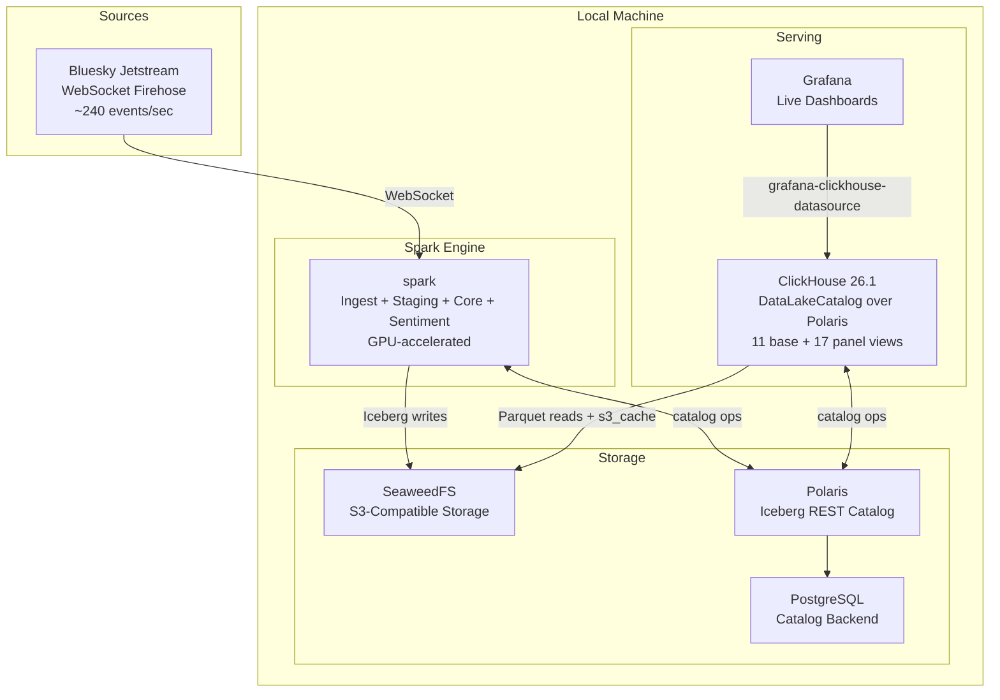
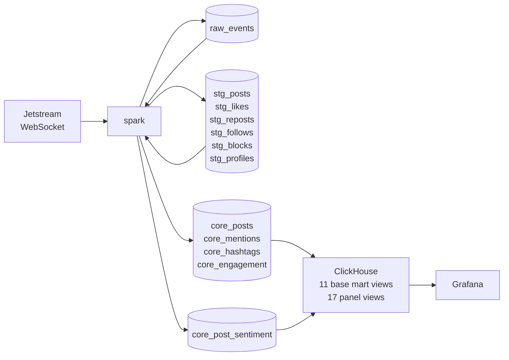
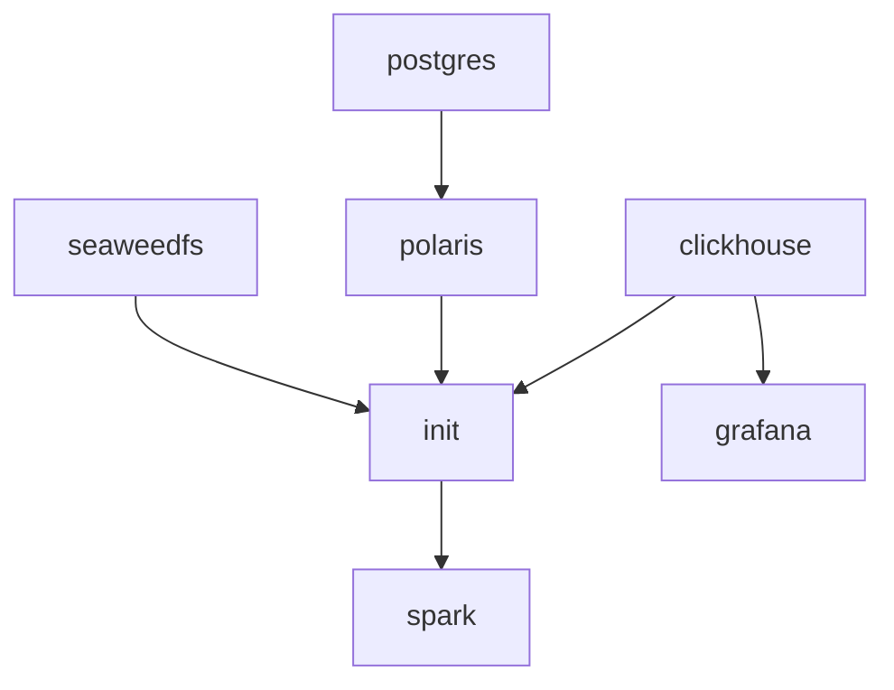

# Technical Design Document
## Atmosphere

| | |
|---|---|
| **Author** | Joshua |
| **Status** | Draft |
| **Created** | 2026-04-11 |
| **Last updated** | 2026-04-11 |

---

## Table of Contents

1. [Introduction](#1-introduction)
2. [Design Goals and Constraints](#2-design-goals-and-constraints)
3. [Architectural Overview](#3-architectural-overview)
4. [Data Sources](#4-data-sources)
5. [Data Model](#5-data-model)
6. [System Components and Modules](#6-system-components-and-modules)
7. [Custom WebSocket Data Source](#7-custom-websocket-data-source)
8. [ML / Sentiment Analysis](#8-ml--sentiment-analysis)
9. [Serving and Interfaces](#9-serving-and-interfaces)
10. [Dashboard Design](#10-dashboard-design)
11. [Error Handling and Resilience](#11-error-handling-and-resilience)
12. [Repository Structure](#12-repository-structure)
13. [Testing and Quality Assurance](#13-testing-and-quality-assurance)
14. [Deployment Strategy](#14-deployment-strategy)
15. [Design Decisions](#15-design-decisions)
16. [Glossary](#16-glossary)

---

## 1. Introduction

Atmosphere is a real-time streaming data platform that ingests the full Bluesky social network firehose, performs multilingual sentiment analysis, and surfaces live analytics through a public Grafana dashboard.

The thesis of Atmosphere is **"a lot with a little."** Apache Spark serves as the unified engine for ingestion, stream processing, transformation, and ML inference. Apache Iceberg provides the storage format. ClickHouse 26.1 reads the Iceberg tables through the Polaris REST catalog and exposes them to Grafana as a two-tier view layer (11 base mart views + 17 panel views). Four core technologies — Spark, Iceberg, ClickHouse, Grafana — share a single Polaris catalog.

Two components distinguish Atmosphere from a conventional streaming pipeline:

- **A custom PySpark Structured Streaming data source** that wraps the Bluesky Jetstream WebSocket, implementing the Spark 4.x Python DataSource V2 API. This is a portfolio-grade demonstration of Spark internals knowledge.
- **GPU-accelerated multilingual sentiment analysis** using a transformer model fine-tuned on social media text, running inside a dedicated Spark container with NVIDIA GPU passthrough.

---

## 2. Design Goals and Constraints

### 2.1 Goals

- Ingest the full Bluesky Jetstream firehose (~240 events/sec, all collections) in real time via a custom PySpark WebSocket data source
- Process events through a three-layer Iceberg medallion (raw → staging → core) using chained Spark Structured Streaming queries
- Perform multilingual sentiment analysis on all posts using a GPU-accelerated transformer model
- Expose live analytics through a Grafana dashboard with 5-second refresh against a ClickHouse view layer over Iceberg
- Demonstrate that a streaming engine (Spark) and an OLAP engine (ClickHouse) can share an Iceberg/Polaris metadata layer without a custom serving service
- Provide a fully reproducible local environment via Docker Compose and a single `make up` command

### 2.2 Scope Boundaries

- Targets single-node local deployment via Docker Compose
- Focuses on aggregate network-level analytics (firehose throughput, sentiment trends, engagement velocity)
- Ingests only publicly available Bluesky data via the Jetstream WebSocket
- Captures live events from the current stream forward; historical coverage grows organically over time
- Schema enforcement is handled inline by Spark transformations

### 2.3 Constraints

| Constraint | Detail |
|---|---|
| Hardware | 32 GB RAM workstation with NVIDIA GPU, running WSL2 on Linux 5.15 |
| Compute budget | ~24 GB allocated to the Docker stack, ~8 GB reserved for the host workstation |
| Data source | Bluesky Jetstream public WebSocket — zero authentication, zero rate limits, 24-hour event TTL on server |
| Runtime | Always-on operation — the pipeline runs continuously while the workstation remains usable |
| Storage | Local only — SeaweedFS (S3-compatible object storage) running in Docker |
| Network | Outbound WebSocket to Jetstream public instances; inbound public access via Cloudflare Tunnel deferred until post-ClickHouse migration |

---

## 3. Architectural Overview

### 3.1 System Diagram



### 3.2 Data Flow

All four streaming layers run in a single unified Spark process (`spark`) sharing one SparkSession and JVM:

1. **Ingest layer** connects to the Bluesky Jetstream WebSocket via a custom Python DataSource V2 source. Raw JSON events are written to `atmosphere.raw.raw_events` in 5-second micro-batches.

2. **Staging layer** reads `raw_events` as a streaming Iceberg source. Events are parsed by collection type, fields are extracted and typed, and results are written to six staging tables (`stg_posts`, `stg_likes`, `stg_reposts`, `stg_follows`, `stg_blocks`, `stg_profiles`).

3. **Core layer** reads staging tables and produces enriched core tables: `core_posts` (with extracted hashtags, mentions, content classification), `core_mentions`, `core_hashtags`, and `core_engagement`.

4. **Sentiment layer** reads `core_posts` and applies the XLM-RoBERTa sentiment model via `mapInPandas` with GPU acceleration. Results are written to `core_post_sentiment`.

5. **ClickHouse view layer** — after the streaming queries are running, `spark/serving/clickhouse_views.py` bootstraps the `atmosphere` ClickHouse database and creates **11 base mart views** (`mart_events_per_second`, `mart_engagement_velocity`, `mart_sentiment_timeseries`, `mart_trending_hashtags`, `mart_most_mentioned`, `mart_language_distribution`, `mart_content_breakdown`, `mart_embed_usage`, `mart_firehose_stats`, `mart_top_posts`, `mart_pipeline_health`) and **17 panel views** (one per Grafana panel) from `spark/serving/views/*.sql`. Base views read directly from `polaris_catalog.{raw,staging,core}.*`; panel views compose on the base views (or read upstream Iceberg directly when no base view fits). Every view ends with `SETTINGS filesystem_cache_name = 's3_cache', enable_filesystem_cache = 1` so SeaweedFS bytes are cached on the ClickHouse node. There is no materialized mart Iceberg layer — all aggregation is computed live in ClickHouse. See §5.5.



### 3.3 Technology Choices and Rationale

| Component | Technology | Rationale |
|---|---|---|
| Streaming engine | Apache Spark 4.x (Structured Streaming) | Built-in Iceberg support in Spark 4.x. A single engine handles ingestion, transformation, and ML inference. |
| Query engine | ClickHouse 26.1 with `DataLakeCatalog` over Polaris | Purpose-built OLAP engine for low-latency dashboard reads. Native Iceberg catalog mount via REST avoids data duplication. Named filesystem cache (`s3_cache`) holds working-set Parquet bytes on the ClickHouse node. |
| Execution mode | `local[*]` per container | Each Spark application runs in its own container using all available cores. Lightweight, memory-efficient, and sufficient for a single-firehose workload. |
| Table format | Apache Iceberg | ACID transactions, schema evolution, partition evolution, and time travel. Native integration with Spark 4.x. |
| Iceberg catalog | Apache Polaris (REST) | External REST catalog enables Spark and ClickHouse to share Iceberg metadata cleanly — a production-standard pattern. |
| Object storage | SeaweedFS | Apache 2.0-licensed, S3-API-compatible object storage. Drop-in replacement for MinIO with active maintenance. Used consistently across the portfolio. |
| Sentiment model | cardiffnlp/twitter-xlm-roberta-base-sentiment | XLM-RoBERTa fine-tuned on ~198M tweets. Covers 100+ languages including Japanese and Korean — critical for Bluesky's multilingual user base. |
| ML inference | HuggingFace Transformers + `mapInPandas` | Vectorized batch inference via Pandas UDFs. GPU-accelerated with NVIDIA container toolkit. |
| Dashboard | Grafana + native `grafana-clickhouse-datasource` | Industry-standard observability platform. Native ClickHouse plugin gives full SQL access without an intermediary REST service. |
| Public access | Cloudflare Tunnel (deferred) | Will be reinstated post-ClickHouse migration. |
| Container orchestration | Docker Compose | Single `make up` command starts the full stack. |
| Python tooling | uv + pyproject.toml | Modern, fast Python dependency management with lockfile support. |

### 3.4 Consolidated Responsibilities

Spark serves six distinct roles that are conventionally handled by separate tools, with ClickHouse handling the seventh (query serving):

| Role | How It Is Handled |
|---|---|
| Message ingestion | Spark — custom DataSource V2 reads directly from the WebSocket |
| Stream processing | Spark — Structured Streaming with 5-second micro-batches |
| Scheduling / orchestration | Spark — each query manages its own cadence via `processingTime` triggers |
| SQL transformation | Spark SQL executed as streaming queries within the unified process |
| Unified batch + stream | Spark — a single streaming engine serves both real-time and analytical workloads |
| Data quality | Spark — DataFrame assertions inline within streaming transformations |
| Query serving | ClickHouse — `DataLakeCatalog` engine over Polaris exposes Iceberg tables; cached SQL views serve Grafana |

---

## 4. Data Sources

### 4.1 Bluesky Jetstream WebSocket

Jetstream is a streaming service operated by the Bluesky team that consumes the AT Protocol firehose (`com.atproto.sync.subscribeRepos`) and re-emits events as lightweight JSON over WebSocket. It converts the binary CBOR-encoded Merkle Search Tree blocks from the protocol into simple, parseable JSON payloads.

**Connection details:**

| Property | Value |
|---|---|
| Protocol | WebSocket (WSS) |
| Endpoint | `wss://jetstream2.us-east.bsky.network/subscribe` |
| Authentication | None required |
| Rate limit | None (server caps at 5,000 events/sec per subscriber) |
| Compression | Optional zstd available; plain JSON used (~135 KB/sec, negligible bandwidth) |
| Event TTL | 24 hours on server (PebbleDB storage) |
| Observed throughput | ~240 events/sec (all collections), ~26 posts/sec |

**Public instances:**

| Hostname | Region |
|---|---|
| `jetstream1.us-east.bsky.network` | US-East |
| `jetstream2.us-east.bsky.network` | US-East |
| `jetstream1.us-west.bsky.network` | US-West |
| `jetstream2.us-west.bsky.network` | US-West |

**Query parameters:**

| Parameter | Type | Description |
|---|---|---|
| `wantedCollections` | string (repeatable) | Filter by collection NSID. Supports prefix wildcards (e.g., `app.bsky.feed.*`). Up to 100 collections. |
| `wantedDids` | string (repeatable) | Filter by DID. Up to 10,000 DIDs. |
| `cursor` | integer | Unix microseconds timestamp. Replay events from this point forward (within 24-hour TTL). |
| `maxMessageSizeBytes` | integer | Cap payload size per message. |
| `compress` | boolean | Enable zstd compression (also settable via `Socket-Encoding: zstd` header). |
| `requireHello` | boolean | Pause event delivery until client sends an `options_update` message. |

**Event envelope schema:**

```json
{
  "did": "did:plc:abc123...",
  "time_us": 1712844567890123,
  "kind": "commit",
  "commit": {
    "rev": "3lq2...",
    "operation": "create",
    "collection": "app.bsky.feed.post",
    "rkey": "3lq2abc...",
    "record": { ... },
    "cid": "bafyrei..."
  }
}
```

**Event kinds:**

| Kind | Description | Frequency |
|---|---|---|
| `commit` | Record create, update, or delete in a user's repository | ~99% of events |
| `identity` | DID document or handle change | Rare |
| `account` | Account status change (active, deactivated, takendown) | Rare |

Identity and account events are delivered to all subscribers regardless of collection filters.

### 4.2 AT Protocol Collections

The following collections are ingested. Field schemas are derived from the AT Protocol Lexicon definitions.

#### app.bsky.feed.post

| Field | Type | Required | Description |
|---|---|---|---|
| `text` | string | Yes | Post content. Max 3,000 bytes / 300 graphemes. |
| `createdAt` | string (datetime) | Yes | ISO 8601 timestamp of post creation. |
| `langs` | array\<string\> | No | BCP-47 language codes (max 3). Present on ~87% of posts. |
| `reply` | object | No | Thread structure: `{root: {uri, cid}, parent: {uri, cid}}`. Present on ~30% of posts. |
| `embed` | union | No | Attached media. Present on ~54% of posts. Types: `images` (45%), `external` (45%), `record` (7%), `recordWithMedia` (3%). |
| `facets` | array | No | Rich text annotations. Present on ~22% of posts. Each facet has byte-indexed `index` and `features` (mention, link, or tag). |
| `labels` | array | No | Self-applied content labels (content warnings). |
| `tags` | array\<string\> | No | Additional hashtags (max 8, max 64 graphemes each). |

#### app.bsky.feed.like

| Field | Type | Required | Description |
|---|---|---|---|
| `subject` | object | Yes | Strong reference: `{uri, cid}` of the liked record. |
| `createdAt` | string (datetime) | Yes | Timestamp of the like action. |
| `via` | object | No | Strong reference indicating the like was discovered through a repost. Present on ~17% of likes. |

#### app.bsky.feed.repost

| Field | Type | Required | Description |
|---|---|---|---|
| `subject` | object | Yes | Strong reference: `{uri, cid}` of the reposted record. |
| `createdAt` | string (datetime) | Yes | Timestamp of the repost action. |

#### app.bsky.graph.follow

| Field | Type | Required | Description |
|---|---|---|---|
| `subject` | string (DID) | Yes | DID of the account being followed. |
| `createdAt` | string (datetime) | Yes | Timestamp of the follow action. |

#### app.bsky.graph.block

| Field | Type | Required | Description |
|---|---|---|---|
| `subject` | string (DID) | Yes | DID of the blocked account. |
| `createdAt` | string (datetime) | Yes | Timestamp of the block action. |

#### app.bsky.actor.profile

Profile update events contain display name, description, avatar, banner, and pinned post references. These are captured at the staging layer; promotion to core and mart layers is planned for a future version.

**Observed collection distribution (500-event sample):**

| Collection | Share |
|---|---|
| app.bsky.feed.like | 66.0% |
| app.bsky.feed.post | 11.2% |
| app.bsky.graph.follow | 10.6% |
| app.bsky.feed.repost | 9.0% |
| app.bsky.graph.block | 0.6% |
| app.bsky.actor.profile | 0.4% |
| Other (threadgate, third-party) | 2.2% |

---

## 5. Data Model

### 5.1 Iceberg Layer Definitions

| Layer | Namespace | Writer | Description |
|---|---|---|---|
| Raw | `atmosphere.raw` | spark (ingest layer) | Verbatim JSON events. Append-only. Immutable after write. |
| Staging | `atmosphere.staging` | spark (staging layer) | Parsed, typed, and cleaned. One table per collection type. |
| Core | `atmosphere.core` | spark (core + sentiment layers) | Enriched entities. Extracted mentions, hashtags, sentiment scores. |

Dashboard-ready aggregates live in the ClickHouse view layer (§5.5), not as Iceberg tables in a mart namespace.

### 5.2 Raw Layer

**`atmosphere.raw.raw_events`**

| Column | Type | Description |
|---|---|---|
| `did` | STRING | Author's decentralized identifier. |
| `time_us` | LONG | Event timestamp in Unix microseconds. |
| `kind` | STRING | Event kind: `commit`, `identity`, or `account`. |
| `collection` | STRING | AT Protocol collection NSID (e.g., `app.bsky.feed.post`). NULL for non-commit events. |
| `operation` | STRING | Commit operation: `create`, `update`, or `delete`. NULL for non-commit events. |
| `raw_json` | STRING | Complete event payload as a JSON string. |
| `ingested_at` | TIMESTAMP | UTC timestamp when the event was written to Iceberg. |

**Partitioning:** `PARTITION BY days(ingested_at), collection`
**Sort order:** `ingested_at ASC`

### 5.3 Staging Layer

All staging tables share a common set of envelope columns derived from the raw event:

| Column | Type | Description |
|---|---|---|
| `did` | STRING | Author DID. |
| `time_us` | LONG | Event timestamp (Unix microseconds). |
| `event_time` | TIMESTAMP | Derived from `time_us`: `TIMESTAMP(time_us / 1000000)`. |
| `rkey` | STRING | Record key (TID). |
| `operation` | STRING | `create`, `update`, or `delete`. |

**`atmosphere.staging.stg_posts`** — additional columns:

| Column | Type | Description |
|---|---|---|
| `text` | STRING | Post text content. |
| `created_at` | TIMESTAMP | Parsed from record `createdAt` field. |
| `langs` | ARRAY\<STRING\> | BCP-47 language codes. |
| `has_embed` | BOOLEAN | Whether the post contains an embed. |
| `embed_type` | STRING | Embed type: `images`, `external`, `record`, `recordWithMedia`, `video`, or NULL. |
| `is_reply` | BOOLEAN | Whether the post is a reply. |
| `reply_root_uri` | STRING | AT-URI of the thread root. NULL if not a reply. |
| `reply_parent_uri` | STRING | AT-URI of the parent post. NULL if not a reply. |
| `facets_json` | STRING | Raw facets array as JSON string (for downstream extraction). |
| `labels_json` | STRING | Raw labels array as JSON string. |
| `tags` | ARRAY\<STRING\> | Additional hashtag tags from the `tags` field. |

**`atmosphere.staging.stg_likes`** — additional columns:

| Column | Type | Description |
|---|---|---|
| `subject_uri` | STRING | AT-URI of the liked record. |
| `subject_cid` | STRING | CID of the liked record. |
| `created_at` | TIMESTAMP | Parsed from record `createdAt`. |
| `has_via` | BOOLEAN | Whether the like has a `via` reference. |

**`atmosphere.staging.stg_reposts`** — additional columns:

| Column | Type | Description |
|---|---|---|
| `subject_uri` | STRING | AT-URI of the reposted record. |
| `subject_cid` | STRING | CID of the reposted record. |
| `created_at` | TIMESTAMP | Parsed from record `createdAt`. |

**`atmosphere.staging.stg_follows`** — additional columns:

| Column | Type | Description |
|---|---|---|
| `subject_did` | STRING | DID of the followed account. |
| `created_at` | TIMESTAMP | Parsed from record `createdAt`. |

**`atmosphere.staging.stg_blocks`** — additional columns:

| Column | Type | Description |
|---|---|---|
| `subject_did` | STRING | DID of the blocked account. |
| `created_at` | TIMESTAMP | Parsed from record `createdAt`. |

**`atmosphere.staging.stg_profiles`** — additional columns:

| Column | Type | Description |
|---|---|---|
| `display_name` | STRING | Profile display name. |
| `description` | STRING | Profile bio/description. |

**Partitioning (all staging tables):** `PARTITION BY days(event_time)`
**Sort order:** `event_time ASC`

### 5.4 Core Layer

**`atmosphere.core.core_posts`** — enriched posts with extracted structured data:

| Column | Type | Description |
|---|---|---|
| `did` | STRING | Author DID. |
| `time_us` | LONG | Event timestamp (Unix microseconds). |
| `event_time` | TIMESTAMP | Derived timestamp. |
| `rkey` | STRING | Record key. |
| `text` | STRING | Post text. |
| `created_at` | TIMESTAMP | Post creation time. |
| `primary_lang` | STRING | First language code from `langs`, or `unknown`. |
| `is_reply` | BOOLEAN | Whether the post is a reply. |
| `has_embed` | BOOLEAN | Whether the post has an embed. |
| `embed_type` | STRING | Embed type classification. |
| `content_type` | STRING | Derived: `original`, `reply`, `quote`, `media_post`. |
| `hashtags` | ARRAY\<STRING\> | Extracted from facets (tag features) and `tags` field. |
| `mention_dids` | ARRAY\<STRING\> | Extracted from facets (mention features). |
| `link_urls` | ARRAY\<STRING\> | Extracted from facets (link features). |
| `char_count` | INT | Character count of `text`. |

**`atmosphere.core.core_post_sentiment`** — sentiment-enriched posts:

| Column | Type | Description |
|---|---|---|
| `did` | STRING | Author DID. |
| `rkey` | STRING | Record key. |
| `event_time` | TIMESTAMP | Event timestamp. |
| `text` | STRING | Post text (for dashboard display). |
| `primary_lang` | STRING | Language code. |
| `sentiment_positive` | FLOAT | Positive sentiment score (0.0–1.0). |
| `sentiment_negative` | FLOAT | Negative sentiment score (0.0–1.0). |
| `sentiment_neutral` | FLOAT | Neutral sentiment score (0.0–1.0). |
| `sentiment_label` | STRING | Dominant sentiment: `positive`, `negative`, or `neutral`. |
| `sentiment_confidence` | FLOAT | Confidence of the dominant label (max of the three scores). |

**`atmosphere.core.core_mentions`** — extracted mention edges:

| Column | Type | Description |
|---|---|---|
| `author_did` | STRING | DID of the post author. |
| `mentioned_did` | STRING | DID of the mentioned account. |
| `post_rkey` | STRING | Record key of the source post. |
| `event_time` | TIMESTAMP | Event timestamp. |

**`atmosphere.core.core_hashtags`** — extracted hashtags:

| Column | Type | Description |
|---|---|---|
| `tag` | STRING | Hashtag text (lowercase, without `#`). |
| `author_did` | STRING | DID of the post author. |
| `post_rkey` | STRING | Record key of the source post. |
| `event_time` | TIMESTAMP | Event timestamp. |

**`atmosphere.core.core_engagement`** — unified engagement events:

| Column | Type | Description |
|---|---|---|
| `event_type` | STRING | `like` or `repost`. |
| `actor_did` | STRING | DID of the user who liked/reposted. |
| `subject_uri` | STRING | AT-URI of the target record. |
| `event_time` | TIMESTAMP | Event timestamp. |

**Partitioning (all core tables):** `PARTITION BY days(event_time)`
**Sort order:** `event_time ASC`

### 5.5 ClickHouse View Layer

There is no longer a materialized mart Iceberg layer. Aggregation runs live in ClickHouse 26.1, which mounts the Polaris REST catalog as a database (`polaris_catalog`) via the `DataLakeCatalog` engine and serves Grafana through a two-tier view layer in the `atmosphere` ClickHouse database. Bootstrap is performed by `spark/serving/clickhouse_views.py`, called from `spark/unified.py` after the streaming queries are running.

**Caching is mandatory.** Every view in `atmosphere.*` ends with:

```sql
SETTINGS filesystem_cache_name = 's3_cache', enable_filesystem_cache = 1
```

The named filesystem cache `s3_cache` is configured at the storage-policy level on the ClickHouse node, but the `DataLakeCatalog` read path does not propagate profile-level cache settings — the `SETTINGS` clause must be attached at the query (or view) level for the cache to fill. This was verified empirically by inspecting `system.filesystem_cache` after view reads.

**Tier 1: Base mart views** (11 views, file: `spark/serving/views/mart_*.sql`). Each base view applies a single aggregation against `polaris_catalog.{raw,staging,core}.*`:

| Base View | Source | Description |
|---|---|---|
| `mart_events_per_second` | `raw.raw_events` | Pipeline throughput per 1-minute bucket |
| `mart_engagement_velocity` | `core.core_engagement` | Likes/reposts/follows per minute, grouped by event type |
| `mart_sentiment_timeseries` | `core.core_post_sentiment` | Avg positive/negative/neutral per minute |
| `mart_trending_hashtags` | `core.core_hashtags` | Tag counts per minute |
| `mart_most_mentioned` | `core.core_mentions` | Mention counts per minute per target DID |
| `mart_language_distribution` | `core.core_posts` | Post counts per language per minute |
| `mart_content_breakdown` | `core.core_posts` | Post counts by content type per minute |
| `mart_embed_usage` | `core.core_posts` | Post counts by embed type per minute |
| `mart_firehose_stats` | `raw.raw_events` | Per-collection event count + approx unique DIDs |
| `mart_top_posts` | `core.core_posts ⨝ core.core_post_sentiment` | Joined view — one row per post with text, language, sentiment |
| `mart_pipeline_health` | `raw.raw_events` | Self-monitoring metrics: events/sec, processing lag, last event time |

**Tier 2: Panel views** (17 views, file: `spark/serving/views/panel_*.sql`). One per Grafana panel; reads `SELECT * FROM atmosphere.panel_<name>`:

| Panel View | Built From | Notes |
|---|---|---|
| `panel_sentiment_timeseries` | `core_post_sentiment` directly | 15-min window, avg per minute |
| `panel_current_sentiment` | `core_post_sentiment` directly | 1-min window, single-row stat |
| `panel_top_posts_positive` / `panel_top_posts_negative` | `mart_top_posts` | 30-min window, ORDER BY sentiment LIMIT 5 |
| `panel_events_per_second_by_collection` | `mart_firehose_stats` | 15-min window, count/60 |
| `panel_operations_breakdown` | `raw.raw_events` directly | 15-min window, GROUP BY operation |
| `panel_active_users` / `panel_total_events` | `mart_firehose_stats` | 5-min sums |
| `panel_language_distribution` | `mart_language_distribution` | top 10, 5-min window |
| `panel_content_breakdown` / `panel_embed_usage` | `mart_content_breakdown` / `mart_embed_usage` | 5-min sums |
| `panel_trending_hashtags` | `mart_trending_hashtags` | Spike-ratio CTE: current 5-min vs prior 25-min baseline |
| `panel_likes_per_second` / `panel_reposts_per_second` | `mart_engagement_velocity` (filtered) | count/60 |
| `panel_follows_per_second` | `staging.stg_follows` directly | filter `operation='create'` |
| `panel_most_mentioned` | `mart_most_mentioned` | top 20, 5-min window |
| `panel_pipeline_health` | `mart_pipeline_health` | passthrough — used by 3 stat panels |

ClickHouse inlines view bodies at query plan time, so layering does not double-execute base aggregations. The split exists so dashboard SQL stays out of the dashboard JSON and so per-panel windowing/limiting can evolve without touching the base views.

**Maintenance:** Because there is no materialized mart Iceberg layer, the only Iceberg tables under maintenance are the 12 raw/staging/core tables. `spark/analysis/maintenance.py` retains its compaction logic for those.

### 5.6 Partitioning and Sort Order Strategy

| Layer | Partition Scheme | Sort Order | Rationale |
|---|---|---|---|
| Raw | `days(ingested_at), collection` | `ingested_at` | Day + collection pruning. Collection as secondary partition skips irrelevant event types on filtered reads. |
| Staging | `days(event_time)` | `event_time` | Daily partitions. Collection-level separation is handled by having one table per collection. |
| Core | `days(event_time)` | `event_time` | Consistent with staging. Time-range queries are the primary access pattern. |

Data retention is set to **30 days** across all layers. Expired partitions are dropped by a maintenance routine.

---

## 6. System Components and Modules

### 6.1 Container Inventory

| Container | Image | Purpose | Memory | Ports |
|---|---|---|---|---|
| `init` | Custom Python | Creates SeaweedFS buckets, Polaris warehouse, and Iceberg namespaces. Exits after completion. | 512 MB | — |
| `seaweedfs` | `chrislusf/seaweedfs:4.19` (thin wrapper) | S3-compatible object storage for all Iceberg data and metadata files. | 1 GB | 9000 (S3, host→8333), 9333 (master) |
| `polaris` | `apache/polaris` | Iceberg REST catalog. Serves table metadata to Spark processes. | 1 GB | 8181 |
| `postgres` | `postgres:16` | Backing store for the Polaris catalog. | 1 GB | 5432 |
| `spark` | Custom (Spark 4.x + CUDA + HuggingFace) | Runs all 4 streaming layers (ingest, staging, core, sentiment) in one JVM and bootstraps the ClickHouse view layer after start. GPU-accelerated sentiment inference. | 14 GB | 4040 (Spark UI) |
| `clickhouse` | Custom (`clickhouse/clickhouse-server:26.1-alpine` + baked config) | Query serving. `DataLakeCatalog` database `polaris_catalog` over Polaris; `atmosphere` database holds 11 base mart views + 17 panel views, all cached against `s3_cache`. | 2 GB | 8123 (HTTP), 9000 (native) |
| `grafana` | Custom (`grafana/grafana-oss` + `grafana-clickhouse-datasource`) | Dashboard rendering. Connects to ClickHouse via the native datasource plugin. | 512 MB | 3000 |

**Total memory allocation: ~22 GB** (within 24 GB budget, leaving ~1.7 GB headroom for JVM overhead and OS caches).

### 6.2 Startup Dependency Chain



Containers use Docker Compose `depends_on` with health checks to enforce ordering. `init` waits for SeaweedFS, Polaris, and ClickHouse to be healthy, then runs its 7-step bootstrap (buckets → Polaris catalog → namespaces → ClickHouse reader principal + RBAC → `polaris_catalog` database) and exits. `spark` depends on `init` completing. `grafana` depends only on `clickhouse` being healthy. All long-running containers run with `restart: unless-stopped`.

### 6.3 Docker Networking

| Network | Purpose | Members |
|---|---|---|
| `atmosphere-data` | Internal data plane. All storage and compute traffic. | seaweedfs, polaris, postgres, init, spark, clickhouse |
| `atmosphere-frontend` | Serving plane. Dashboard access. | clickhouse, grafana |

`clickhouse` is dual-homed on both networks — it reads Iceberg data from SeaweedFS/Polaris on the data network and serves Grafana on the frontend network.

### 6.4 Init Service

The init container runs a 7-step idempotent bootstrap and exits:

1. **SeaweedFS wait + bucket** — waits for SeaweedFS to be healthy and creates the `warehouse` bucket for Iceberg data files.
2. **Polaris wait** — polls `/api/management/v1/catalogs` until Polaris is healthy.
3. **Polaris catalog** — creates the `atmosphere` catalog with `polaris.config.drop-with-purge.enabled=true`.
4. **Iceberg namespaces** — creates three namespaces: `atmosphere.raw`, `atmosphere.staging`, `atmosphere.core`.
5. **ClickHouse reader principal + RBAC** — provisions the Polaris principal `clickhouse`, the principal role `clickhouse_reader`, and the catalog role `atmosphere_reader` with read grants at catalog scope. Polaris generates the client secret server-side on first create; it is persisted to the `polaris-creds` named volume (`/var/polaris-creds/clickhouse.json`) and reused on restart.
6. **ClickHouse `polaris_catalog` database** — runs `CREATE DATABASE polaris_catalog ENGINE = DataLakeCatalog(...)` against ClickHouse, wiring the stored client secret in.

After init exits, `spark` starts — it creates Iceberg tables via `CREATE TABLE IF NOT EXISTS` on first write, and once streaming queries are running it calls `spark/serving/clickhouse_views.py` to create the `atmosphere` ClickHouse database and the 11 base mart + 17 panel views.

### 6.5 Volume Mounts

| Volume | Container(s) | Path | Purpose |
|---|---|---|---|
| `seaweedfs-data` | seaweedfs | `/data` | Persistent object storage |
| `postgres-data` | postgres | `/var/lib/postgresql/data` | Catalog metadata |
| `polaris-creds` | init, clickhouse | `/var/polaris-creds` | Server-generated Polaris client secret for the ClickHouse reader principal |
| `clickhouse-data` | clickhouse | `/var/lib/clickhouse` | ClickHouse state + filesystem cache for `s3_cache` |
| `spark-checkpoints` | spark | `/opt/spark/checkpoints` | Streaming checkpoint state (subdirs: ingest-raw, staging, core/posts, core/engagement, sentiment) |
| `grafana-data` | grafana | `/var/lib/grafana` | Dashboard state and plugin cache |

---

## 7. Custom WebSocket Data Source

### 7.1 Design Rationale

Atmosphere implements a custom PySpark Structured Streaming data source that reads directly from the Jetstream WebSocket. Spark ingests the firehose as a first-class streaming source with full offset tracking and checkpoint integration.

This design choice serves two purposes:

1. **Architectural simplicity** — a single-source, single-consumer pipeline benefits from the fewest possible components. Direct WebSocket ingestion keeps the architecture to Spark, Iceberg, and Grafana.
2. **First-class streaming contract** — implementing a DataSource V2 provider integrates the WebSocket into Spark's streaming source contract: offset tracking, commit semantics, and micro-batch lifecycle are handled by the engine rather than bolted on alongside it.

### 7.2 Python DataSource V2 API

Spark 4.x introduces a Python-native DataSource API for implementing custom sources entirely in Python. The implementation consists of two classes:

**`JetstreamDataSource(DataSource)`** — registered with Spark as a named data source. Provides factory methods for creating readers.

**`JetstreamStreamReader(SimpleStreamReader)`** — manages the WebSocket connection and yields event batches to Spark on each micro-batch trigger. Implements the following contract:

| Method | Responsibility |
|---|---|
| `initialOffset()` | Returns the starting offset. Uses the current time in microseconds to begin capturing live events. |
| `read(start)` | Called by Spark on each micro-batch. Returns `(rows, offset)` — the batch of events since `start` and the new offset position. |
| `commit(end)` | Called after a micro-batch is successfully committed. Persists the offset for cursor-based reconnection. |
| `schema()` | Returns the output schema — matches the `raw_events` table structure. |

### 7.3 Connection Lifecycle

1. **Connect** — the reader opens a WebSocket to `wss://jetstream2.us-east.bsky.network/subscribe` requesting all collections.
2. **Buffer** — incoming events are buffered in memory between `read()` calls. The buffer is bounded (configurable, default 50,000 events) to provide backpressure.
3. **Yield** — on each `read()` call, the buffer is drained and returned as a batch of rows. The latest `time_us` value becomes the new offset.
4. **Reconnect** — on disconnect, the reader reconnects with `?cursor={last_time_us - 5_000_000}` (5-second buffer) to ensure gapless recovery within Jetstream's 24-hour event TTL.

### 7.4 Offset Tracking

Offset tracking uses a dual mechanism:

- **Spark checkpoint** — Spark's built-in checkpoint system persists the offset returned by `read()` to a named Docker volume. On container restart, Spark recovers the last committed offset automatically.
- **Jetstream cursor** — the `cursor` query parameter allows the WebSocket to replay events from a specific microsecond timestamp. The reader uses the last committed `time_us` (minus a 5-second safety buffer) as the cursor on reconnection.

This dual approach ensures that transient disconnects, container restarts, and full stack restarts all recover cleanly within Jetstream's 24-hour retention window.

### 7.5 Micro-batch Boundary Logic

The streaming query is configured with `trigger(processingTime="5 seconds")`. On each trigger:

1. Spark calls `read(start_offset)`.
2. The reader drains all buffered events received since the last call.
3. Events are returned as a DataFrame with the `raw_events` schema.
4. Spark writes the batch to `atmosphere.raw.raw_events` via the Iceberg sink.
5. On commit, `commit(end_offset)` is called — the reader updates its internal cursor.

At ~240 events/sec, each 5-second batch contains approximately 1,200 events (~340 KB). This volume fits comfortably within Spark's single-partition processing capacity.

### 7.6 Error Handling and Backpressure

| Scenario | Behavior |
|---|---|
| WebSocket disconnect | Automatic reconnect with exponential backoff (1s, 2s, 4s, 8s, max 30s). Reconnect uses cursor for gapless recovery. |
| Buffer overflow | If the buffer exceeds its capacity between `read()` calls, the oldest events are evicted and a warning is logged. At normal throughput and 5-second triggers, the buffer operates well within capacity. |
| Jetstream server error | Failover to an alternate public instance (e.g., `jetstream1.us-east.bsky.network`). |
| Spark micro-batch failure | Spark retries the batch from the last committed offset. The WebSocket buffer continues accumulating independently. |
| Malformed JSON | Malformed events are logged and skipped. The `raw_json` column stores the original payload for debugging. |

---

## 8. ML / Sentiment Analysis

### 8.1 Model Selection

The sentiment model is **cardiffnlp/twitter-xlm-roberta-base-sentiment**, an XLM-RoBERTa model fine-tuned on approximately 198 million tweets for three-class sentiment classification (positive, negative, neutral).

| Property | Value |
|---|---|
| Architecture | XLM-RoBERTa (cross-lingual transformer) |
| Training data | ~198M tweets |
| Languages | 100+ (including English, Japanese, Korean, Spanish, German, French) |
| Output classes | `positive`, `negative`, `neutral` |
| Model size | ~1.1 GB |
| Max input length | 512 tokens (sufficient for Bluesky's 300-grapheme post limit) |

Bluesky's user base is multilingual — Japanese constitutes approximately 26% of posts in observed samples. This model provides sentiment coverage across all languages in a single forward pass, including English, Japanese, Korean, Spanish, German, and French.

### 8.2 Inference Pipeline

The sentiment layer (within spark) runs a Spark Structured Streaming query that:

1. Reads `atmosphere.core.core_posts` as a streaming Iceberg source.
2. Applies the sentiment model via `mapInPandas`, a Pandas UDF that processes batches of rows as Pandas DataFrames.
3. Writes results to `atmosphere.core.core_post_sentiment`.

The `mapInPandas` pattern is chosen over scalar UDFs because it enables vectorized batch inference — the HuggingFace pipeline processes multiple texts in a single forward pass, maximizing GPU utilization.

```python
def predict_sentiment(batches: Iterator[pd.DataFrame]) -> Iterator[pd.DataFrame]:
    model = pipeline("sentiment-analysis",
                     model="cardiffnlp/twitter-xlm-roberta-base-sentiment",
                     device=0,  # GPU
                     batch_size=64)
    for batch in batches:
        results = model(batch["text"].tolist(), truncation=True)
        batch["sentiment_label"] = [r["label"] for r in results]
        batch["sentiment_confidence"] = [r["score"] for r in results]
        # ... expand to positive/negative/neutral scores
        yield batch
```

The model is loaded once per Python worker process and reused across all batches within the partition. Spark's `mapInPandas` guarantees that the iterator is consumed sequentially within a single process, so the model remains in GPU memory for the lifetime of the streaming query.

### 8.3 GPU Acceleration

| Component | Configuration |
|---|---|
| Host requirement | NVIDIA GPU with CUDA support, `nvidia-container-toolkit` installed |
| Docker runtime | `nvidia` runtime specified in `docker-compose.yml` |
| Base image | `nvidia/cuda:12.x-runtime` with Spark 4.x and Python 3.11 |
| Device access | `deploy.resources.reservations.devices: [capabilities: [gpu]]` |
| PyTorch | CPU+CUDA build (`torch` with CUDA 12.x) |
| HuggingFace | `transformers` + `accelerate` libraries |

The model is downloaded during Docker image build (`RUN python -c "from transformers import pipeline; pipeline('sentiment-analysis', model='cardiffnlp/twitter-xlm-roberta-base-sentiment')"`) and embedded in the image for instant startup and reproducible builds.

### 8.4 Batching Strategy

| Parameter | Value | Rationale |
|---|---|---|
| HuggingFace `batch_size` | 64 | Balances GPU memory usage against throughput. XLM-RoBERTa with batch=64 fits comfortably in 8 GB VRAM. |
| Spark `mapInPandas` batch size | Spark default (Arrow batch size) | Spark controls how many rows are sent to each `mapInPandas` call. The HuggingFace pipeline internally sub-batches at 64. |
| Trigger interval | 5 seconds | Aligned with upstream core layer. At ~26 posts/sec, each batch contains ~130 posts — a single GPU forward pass completes in <1 second. |

**Throughput estimate:** At batch_size=64, XLM-RoBERTa on a consumer NVIDIA GPU processes approximately 200-500 texts/sec. At ~26 posts/sec inbound, the GPU is utilized at 5-13% — substantial headroom for peak hours.

### 8.5 GPU Fallback

The container detects GPU availability at startup via `torch.cuda.is_available()`. When running on CPU (e.g., during development on a different machine), the pipeline sets `device=-1` in the HuggingFace pipeline. CPU throughput is approximately 5-15 texts/sec — sufficient for development and testing workflows.

### 8.6 Output Schema

The sentiment output enriches each post with five additional columns:

| Column | Type | Range | Description |
|---|---|---|---|
| `sentiment_positive` | FLOAT | 0.0–1.0 | Model's positive class probability. |
| `sentiment_negative` | FLOAT | 0.0–1.0 | Model's negative class probability. |
| `sentiment_neutral` | FLOAT | 0.0–1.0 | Model's neutral class probability. |
| `sentiment_label` | STRING | `positive`, `negative`, `neutral` | Argmax of the three scores. |
| `sentiment_confidence` | FLOAT | 0.33–1.0 | Score of the dominant label. |

The three probability scores sum to 1.0 for each post. The `sentiment_label` is the class with the highest probability, and `sentiment_confidence` is that probability value.

---

## 9. Serving and Interfaces

### 9.1 ClickHouse

The `clickhouse` container runs `clickhouse/clickhouse-server:26.1-alpine` with a thin wrapper image (`docker/clickhouse/Dockerfile`) that bakes `config.d/` and `users.d/` into the image at build time. Two users are provisioned:

| User | Profile | Purpose |
|---|---|---|
| `atmosphere_admin` | `default` with DDL | One-shot use by `spark/serving/clickhouse_views.py` to create the `atmosphere` database and views. Network-restricted. |
| `atmosphere_reader` | `readonly` | The only user Grafana logs in as. Limited to `SELECT` on `atmosphere.*` and `polaris_catalog.*`. |

The `polaris_catalog` database is created by the init container on first boot via a `CREATE DATABASE ... ENGINE = DataLakeCatalog(...)` statement that points at Polaris and carries the server-generated client secret for the `clickhouse` Polaris principal. The `atmosphere` database is created by spark on startup, along with the 11 base mart + 17 panel views from `spark/serving/views/`.

The named filesystem cache `s3_cache` is configured at the storage-policy level and backed by a sub-path of the `clickhouse-data` volume. Every view must end with `SETTINGS filesystem_cache_name = 's3_cache', enable_filesystem_cache = 1` for the cache to fill — the `DataLakeCatalog` read path does not inherit profile-level cache settings.

| Property | Value |
|---|---|
| Image | `clickhouse/clickhouse-server:26.1-alpine` (custom wrapper) |
| HTTP port | 8123 |
| Native port | 9000 |
| Health check | `wget -qO- http://127.0.0.1:8123/ping` |
| Memory limit | 2 GB |
| Volume | `clickhouse-data` (state + filesystem cache), `polaris-creds` (ro) |

### 9.2 Grafana Connection

Grafana connects to ClickHouse via the native **`grafana-clickhouse-datasource`** plugin (v4.14.0), installed at image build time from `grafana/Dockerfile`. Datasource provisioning lives at `grafana/provisioning/datasources/clickhouse.yml`:

| Setting | Value |
|---|---|
| Plugin | `grafana-clickhouse-datasource` (native) |
| Host | `clickhouse` |
| Port | 8123 (HTTP) |
| Default database | `atmosphere` |
| User | `${CLICKHOUSE_READER_USER}` (`atmosphere_reader`) |
| UID | `clickhouse-atmosphere` |

The provisioning file includes a `deleteDatasources` block that evicts any stale `Atmosphere` / `infinity-atmosphere` entries from the persistent `grafana-data` SQLite on startup. This matters during migration because old datasource rows survive image rebuilds.

Every dashboard panel query is simply:

```sql
SELECT * FROM atmosphere.panel_<name>
```

All SQL lives in `spark/serving/views/`, not in the dashboard JSON. Panels refresh every 5 seconds, aligned with the upstream micro-batch trigger.

### 9.3 Cloudflare Tunnel (Deferred)

The public-URL path via Cloudflare Tunnel is temporarily removed during the ClickHouse migration. The `cloudflared` container is absent from `docker-compose.yml`. Reinstating it is planned after CH-08/CH-09; the target architecture is the same outbound-only QUIC tunnel from a local `cloudflared` container to the Cloudflare edge, with Grafana as the origin service.

---

## 10. Dashboard Design

### 10.1 Panel Layout

The Grafana dashboard is organized into five horizontal rows, each targeting a distinct analytical domain. All panels share a common time range selector and auto-refresh at 5-second intervals.

Every panel target is `SELECT * FROM atmosphere.panel_<name>`; the SQL lives in `spark/serving/views/panel_*.sql`.

### 10.2 Row 1: Sentiment Live Feed

| Panel | Type | Panel View |
|---|---|---|
| Rolling Sentiment Score | Time series | `panel_sentiment_timeseries` |
| Current Sentiment Gauge | Gauge | `panel_current_sentiment` |
| Top 5 Most Positive Posts | Table | `panel_top_posts_positive` |
| Top 5 Most Negative Posts | Table | `panel_top_posts_negative` |

### 10.3 Row 2: Firehose Activity

| Panel | Type | Panel View |
|---|---|---|
| Events/sec by Collection | Stacked area chart | `panel_events_per_second_by_collection` |
| Operations Breakdown | Time series | `panel_operations_breakdown` |
| Unique Users (5-min window) | Stat | `panel_active_users` |
| Total Event Counter | Stat | `panel_total_events` |

### 10.4 Row 3: Language & Content

| Panel | Type | Panel View |
|---|---|---|
| Language Distribution | Pie chart | `panel_language_distribution` |
| Post Type Ratio | Bar chart | `panel_content_breakdown` |
| Embed Usage | Bar chart | `panel_embed_usage` |
| Trending Hashtags | Table | `panel_trending_hashtags` |

### 10.5 Row 4: Engagement Velocity

| Panel | Type | Panel View |
|---|---|---|
| Likes per Second | Time series | `panel_likes_per_second` |
| Reposts per Second | Time series | `panel_reposts_per_second` |
| Follow Rate | Time series | `panel_follows_per_second` |
| Most Mentioned Accounts | Table | `panel_most_mentioned` |

### 10.6 Row 5: Pipeline Health

| Panel | Type | Panel View |
|---|---|---|
| Events Ingested/sec | Stat | `panel_pipeline_health` |
| Processing Lag | Stat | `panel_pipeline_health` |
| Last Event Ingested | Stat | `panel_pipeline_health` |

### 10.7 Provisioning

All dashboard configuration is committed to the repository as code:

- `grafana/provisioning/datasources/clickhouse.yml` — auto-configures the ClickHouse datasource (UID `clickhouse-atmosphere`) with env-var templated reader credentials and a `deleteDatasources` block for stale entries
- `grafana/provisioning/dashboards/dashboard.yml` — dashboard provisioning configuration
- `grafana/dashboards/atmosphere.json` — complete dashboard definition; every panel target is `SELECT * FROM atmosphere.panel_*`

The dashboard is fully functional on first `docker compose up` once spark has finished bootstrapping the ClickHouse view layer.

---

## 11. Error Handling and Resilience

### 11.1 WebSocket Disconnect Recovery

The custom data source implements automatic reconnection with the following strategy:

1. On disconnect, log the event and the last known `time_us` offset.
2. Wait with exponential backoff: 1s → 2s → 4s → 8s → 16s → 30s (capped).
3. Reconnect to the Jetstream endpoint with `?cursor={last_time_us - 5_000_000}` (5-second overlap).
4. If the primary endpoint fails after 3 attempts, failover to an alternate public instance.
5. Deduplicate overlapping events downstream (staging layer deduplicates on `did + rkey + time_us`).

### 11.2 Spark Checkpoint Guarantees

Each Spark Structured Streaming query writes checkpoint data to a named Docker volume. Checkpoints include:

- **Offset log** — tracks which offsets have been committed.
- **Commit log** — records successfully written micro-batches.
- **State store** — persists stateful operations (watermarks, aggregations).

On container restart, Spark reads the checkpoint and resumes from the last committed offset, providing exactly-once semantics within the Spark checkpoint boundary.

### 11.3 Container Restart Policies

All long-running containers are configured with `restart: unless-stopped`. The `init` container uses `restart: "no"` — it exits after setup completes.

Health checks are defined for critical services:

| Container | Health Check |
|---|---|
| seaweedfs | HTTP GET to master `/cluster/status` |
| polaris | HTTP GET to `/api/v1/config` |
| postgres | `pg_isready` |
| clickhouse | `wget -qO- http://127.0.0.1:8123/ping` |
| grafana | HTTP GET to `/api/health` |

### 11.4 Stale Data Handling

If the spark process stops or a streaming query falls behind, Grafana continues to display the last known data. Dashboard panels show stale timestamps rather than empty panels. The Pipeline Health row (§10.6) surfaces lag metrics so the operator can identify which layer is behind.

### 11.5 GPU Fallback

The sentiment layer detects GPU availability at startup:

```python
device = 0 if torch.cuda.is_available() else -1
```

The layer adapts automatically at startup — GPU when available, CPU otherwise. CPU inference is sufficient for development and testing workflows.

---

## 12. Repository Structure

```
atmosphere/
├── CLAUDE.md                              # Claude Code project guidance
├── TECHNICAL_DESIGN.md                    # This document
├── README.md                              # Project overview, setup, architecture diagram
├── Makefile                               # up, down, logs, status, clean targets
├── docker-compose.yml                     # Full service stack definition
├── .env.example                           # Environment variable template
├── .gitignore
│
├── spark/
│   ├── Dockerfile.sentiment               # Unified image: Spark 4.x + CUDA + HuggingFace + model weights
│   ├── conf/
│   │   └── spark-defaults.conf            # Iceberg catalog, S3/SeaweedFS, checkpointing config
│   ├── sources/
│   │   └── jetstream_source.py            # Custom WebSocket DataSource V2 implementation
│   ├── unified.py                         # Consolidated entrypoint (5 streaming queries + CH view bootstrap)
│   ├── ingestion/
│   │   └── ingest_raw.py                  # Ingest layer: WebSocket → raw_events
│   ├── transforms/
│   │   ├── staging.py                     # Staging layer: raw → stg_* tables
│   │   ├── core.py                        # Core layer: stg → core_* tables
│   │   ├── sentiment.py                   # Sentiment layer: core_posts → core_post_sentiment
│   │   └── sql/
│   │       ├── staging/                   # SQL files for staging transforms
│   │       └── core/                      # SQL files for core transforms
│   └── serving/
│       ├── clickhouse_views.py            # Bootstrap: creates atmosphere DB + 28 views
│       └── views/
│           ├── mart_*.sql                 # 11 base mart views over polaris_catalog.{raw,staging,core}
│           └── panel_*.sql                # 17 panel views — one per Grafana panel
│
├── docker/
│   ├── clickhouse/
│   │   ├── Dockerfile                     # Thin wrapper over clickhouse-server:26.1-alpine
│   │   ├── config.d/                      # Storage policy, filesystem cache, network binds
│   │   └── users.d/                       # atmosphere_reader + atmosphere_admin
│   └── seaweedfs/
│       ├── Dockerfile                     # Thin wrapper; envsubsts s3.json at startup
│       └── s3.json.template
│
├── infra/
│   └── init/
│       ├── setup.py                       # 7-step bootstrap (seaweedfs, polaris, CH reader principal + polaris_catalog)
│       └── Dockerfile                     # Python image with boto3 + requests
│
├── grafana/
│   ├── Dockerfile                         # grafana-oss + grafana-clickhouse-datasource plugin
│   ├── provisioning/
│   │   ├── datasources/
│   │   │   └── clickhouse.yml              # ClickHouse datasource + deleteDatasources for stale entries
│   │   └── dashboards/
│   │       └── dashboard.yml              # Dashboard provisioning config
│   └── dashboards/
│       └── atmosphere.json                # Main dashboard definition (all panels SELECT * FROM atmosphere.panel_*)
│
└── docs/
    └── architecture.md                    # Extended architecture documentation + Mermaid source
```

---

## 13. Testing and Quality Assurance

Formal test suites and data quality frameworks are deferred to a post-MVP phase. During development, the following informal validation approach is used:

### 13.1 Smoke Tests

- **Ingestion health:** Verify `raw_events` row count increases steadily by querying via ClickHouse: `SELECT count() FROM polaris_catalog.\`raw.raw_events\` WHERE ingested_at > now() - INTERVAL 1 MINUTE`.
- **Staging completeness:** Verify all six staging tables receive data: `SELECT 'stg_posts' AS tbl, COUNT(*) FROM atmosphere.staging.stg_posts UNION ALL ...`.
- **Sentiment coverage:** Verify `core_post_sentiment` rows align with `core_posts`: `SELECT COUNT(*) FROM atmosphere.core.core_post_sentiment WHERE event_time > current_timestamp - INTERVAL 5 MINUTES`.

### 13.2 Data Spot-Checks

- Compare raw JSON payloads against staging column values for a sample of events.
- Verify sentiment labels are reasonable by inspecting posts with extreme positive/negative scores.
- Confirm hashtag and mention extraction by comparing `core_hashtags` entries against `facets_json` in `stg_posts`.

### 13.3 Pipeline Health Monitoring

The `mart_pipeline_health` table and corresponding Grafana dashboard row (§10.6) provide continuous self-monitoring. Processing lag exceeding 30 seconds indicates a bottleneck in the streaming chain.

---

## 14. Deployment Strategy

### 14.1 Local Development

The full stack starts with a single command:

```bash
make up
```

This executes `docker compose up -d` with the appropriate profiles and environment variables. The Makefile provides additional targets:

| Target | Command | Description |
|---|---|---|
| `make up` | `docker compose up -d` | Start all containers |
| `make down` | `docker compose down` | Stop all containers |
| `make logs` | `docker compose logs -f` | Tail all container logs |
| `make status` | `docker compose ps` | Show container status |
| `make clean` | `docker compose down -v` | Stop and remove all volumes (full reset) |

On first run, the `init` container creates the necessary infrastructure (buckets, catalog, namespaces), then exits. Subsequent `make up` invocations skip initialization (idempotent checks).

### 14.2 Cloudflare Tunnel Setup (Deferred)

Cloudflare Tunnel is deferred until after the ClickHouse migration stabilizes. The target architecture remains a local `cloudflared` container with Grafana as the origin service, reinstated as a standalone PR once CH-08/CH-09 land.

---

## 15. Design Decisions

### 15.1 Direct WebSocket ingestion

The Jetstream WebSocket is a single-source, single-consumer stream. Jetstream provides cursor-based replay with 24-hour retention, and the pipeline has a single consumer (Spark). Spark ingests directly from the WebSocket via a custom data source, keeping the architecture to the fewest possible moving parts.

### 15.2 Custom DataSource V2 for ingestion

The DataSource V2 API integrates natively with Spark's offset and checkpoint machinery, providing exactly-once guarantees within the streaming contract. It manages the WebSocket connection lifecycle, offset tracking, and micro-batch boundaries as a first-class Spark citizen — the same contract used by Kafka and Iceberg sources.

### 15.3 Unified streaming process with separate query serving

The four streaming layers (ingest, staging, core, sentiment) run in a single `spark` container sharing one SparkSession and JVM. Query serving lives in a dedicated `clickhouse` container using the `DataLakeCatalog` engine to read the same Iceberg tables through Polaris. This separation keeps the streaming workload isolated from dashboard reads while letting both engines share a single source of truth via the REST catalog.

### 15.4 Adaptive GPU/CPU inference

The XLM-RoBERTa model runs on GPU when available (`device=0`) and adapts to CPU (`device=-1`). GPU provides headroom for peak throughput; CPU is sufficient for development and testing. The pipeline adapts automatically at startup via `torch.cuda.is_available()`.

### 15.5 Vectorized batch inference via mapInPandas

`mapInPandas` processes entire partitions as Pandas DataFrames, enabling the HuggingFace pipeline to batch multiple texts into a single forward pass. A batch_size of 64 achieves 10-50x throughput compared to single-text inference, maximizing GPU utilization.

### 15.6 Centralized REST catalog (Polaris)

Spark and ClickHouse read table metadata concurrently. The Polaris REST catalog serializes all metadata operations through a single service, providing clean multi-engine coordination. Both engines share a consistent view of table state. ClickHouse authenticates as a dedicated reader principal (`clickhouse`) provisioned by the init container; the server-generated client secret is persisted to the `polaris-creds` named volume and reused across restarts.

### 15.7 ClickHouse view layer over Iceberg (no materialized marts)

The previous design materialized 10 mart Iceberg tables via streaming queries. That design has been replaced by a ClickHouse view layer over the unmodified medallion (raw → staging → core). 11 base `mart_*` views run the base aggregations; 17 `panel_*` views compose on top (one per Grafana panel). Rationale:

- **One source of truth.** The streaming pipeline writes only the 12 medallion tables; no double-bookkeeping between materialized marts and their upstream sources.
- **Cached, not materialized.** ClickHouse's named filesystem cache `s3_cache` holds hot Parquet bytes locally. Warm queries hit the cache, not SeaweedFS.
- **No streaming top-N brittleness.** Panel views apply `ORDER BY … LIMIT N` at read time.
- **Dashboard SQL lives in the repo.** Grafana panels query `SELECT * FROM atmosphere.panel_<name>` — all SQL is versioned under `spark/serving/views/`.

The mandatory `SETTINGS filesystem_cache_name = 's3_cache', enable_filesystem_cache = 1` clause on every view is a hard rule: the `DataLakeCatalog` read path does not inherit profile-level cache settings and without the SETTINGS the cache stays empty. Verified empirically.

### 15.8 Iceberg compaction

Streaming writes produce many small files (baseline: ~60 k files across ~1.1 GB under steady state, 17–37 KB avg). `spark/analysis/maintenance.py` runs compaction (`rewrite_data_files` + `expire_snapshots`) against the 12 raw/staging/core tables, currently invoked ad-hoc inside the `spark` container. Threshold: `file_count > 500 OR avg_file_kb < 30`. Per-table 10-minute rate limit prevents thrashing. Snapshot retention: 1 day. `partial-progress.enabled=true` keeps a single file-group failure on large raw/staging tables from rolling back the whole rewrite.

### 15.8 30-day retention window

Thirty days of data enables monthly trend analysis with manageable storage. At ~240 events/sec, 30 days produces approximately 622 million raw events. Iceberg's columnar Parquet storage and partition pruning keep time-bounded dashboard queries in sub-second response times.

### 15.9 Append-only event model

All events — including deletes (3.4% of observed traffic) — are captured in raw and staging layers. Mart-layer aggregations count only create and update operations. The original content was public when posted; the full event history is preserved for audit and analysis.

### 15.10 Plain JSON WebSocket transport

Jetstream supports zstd compression with a custom dictionary (~56% size reduction). The pipeline uses plain JSON because uncompressed throughput is ~135 KB/sec — negligible bandwidth — and plain JSON keeps the ingestion hot path simple and dependency-free.

### 15.11 Build-time model embedding

The XLM-RoBERTa model (~1.1 GB) is downloaded during `docker build` and embedded in the image. This ensures reproducible builds and instant container startup with zero runtime network dependencies. The resulting image (~6 GB with CUDA + model) is built once and cached.

### 15.12 Spark 4.x local[*] mode

Spark 4.x includes built-in Iceberg support, the Python DataSource V2 API, and improved streaming performance. `local[*]` mode runs the unified application using all available CPU cores — lightweight, memory-efficient, and purpose-fit for a single-firehose workload.

---

## 16. Glossary

| Term | Definition |
|---|---|
| **AT Protocol** | The Authenticated Transfer Protocol — the decentralized social networking protocol underlying Bluesky. |
| **Bluesky** | A decentralized social network built on the AT Protocol. |
| **CID** | Content Identifier — a cryptographic hash that uniquely identifies a piece of content in the AT Protocol. |
| **Collection** | A named set of records within a user's repository, identified by an NSID (e.g., `app.bsky.feed.post`). |
| **DID** | Decentralized Identifier — a globally unique, persistent identifier for a user account (e.g., `did:plc:abc123`). |
| **Facet** | A rich text annotation in a Bluesky post, using byte-indexed ranges to mark mentions, links, or hashtags within the text. |
| **Firehose** | The real-time stream of all events across the AT Protocol network (`com.atproto.sync.subscribeRepos`). |
| **Iceberg** | Apache Iceberg — an open table format providing ACID transactions, schema evolution, and time travel for large analytical datasets. |
| **Jetstream** | A service that converts the AT Protocol's binary CBOR firehose into lightweight JSON events delivered over WebSocket. |
| **Medallion architecture** | A data organization pattern with progressively refined layers. Atmosphere implements raw → staging → core as Iceberg tables; "mart-layer" aggregation lives in ClickHouse views, not materialized Iceberg tables. |
| **NSID** | Namespaced Identifier — a reverse-DNS-style identifier for AT Protocol record types (e.g., `app.bsky.feed.post`). |
| **PDS** | Personal Data Server — a user's data host in the AT Protocol. Stores repositories and handles authentication. |
| **Polaris** | Apache Polaris — an open-source Iceberg REST catalog for multi-engine metadata management. |
| **rkey** | Record Key — a unique identifier for a record within a collection, typically a TID (timestamp-based identifier). |
| **SeaweedFS** | An Apache 2.0-licensed, S3-API-compatible object storage server. Used as the storage backend for Iceberg data files. |
| **Strong reference** | An AT Protocol reference consisting of a URI and CID pair, uniquely identifying a specific version of a record. |
| **ClickHouse `DataLakeCatalog`** | A ClickHouse database engine that mounts an Iceberg REST catalog (Polaris) as a queryable database, exposing every catalog table to ClickHouse SQL without ingestion. Introduced in 24.x, hardened in 26.x. |
| **`s3_cache`** | The named filesystem cache on the ClickHouse storage policy. Every view under `atmosphere.*` must end with `SETTINGS filesystem_cache_name = 's3_cache', enable_filesystem_cache = 1` because the `DataLakeCatalog` read path does not propagate profile-level cache settings. |
| **TID** | Timestamp Identifier — a base32-encoded timestamp used as record keys in the AT Protocol. |
| **XLM-RoBERTa** | A cross-lingual transformer model trained on 100+ languages, used here for multilingual sentiment classification. |
