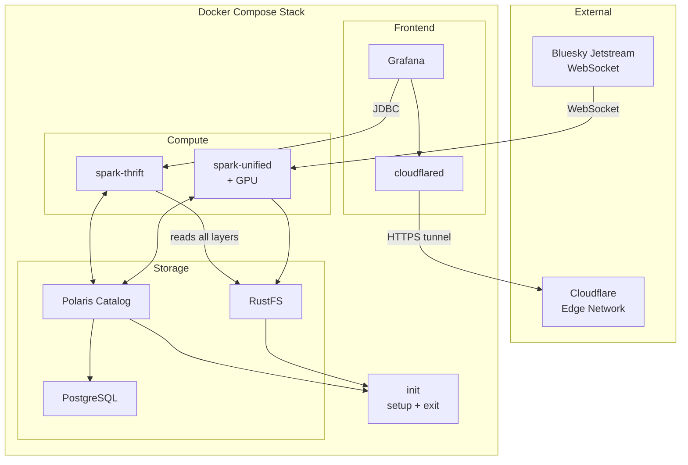
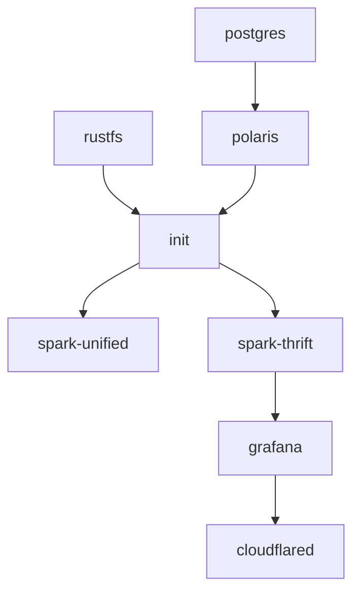

# Technical Requirements Document
## Atmosphere

| | |
|---|---|
| **Document ID** | TRD-ATMOSPHERE-001 |
| **Author** | Joshua |
| **Status** | Draft |
| **Created** | 2026-04-11 |
| **Last updated** | 2026-04-11 |

---

## Table of Contents

1. [Introduction](#1-introduction)
2. [Definitions and Acronyms](#2-definitions-and-acronyms)
3. [References](#3-references)
4. [Overall Description](#4-overall-description)
5. [Functional Requirements](#5-functional-requirements)
6. [Non-Functional Requirements](#6-non-functional-requirements)
7. [System Architecture and Design](#7-system-architecture-and-design)
8. [Technical Specifications](#8-technical-specifications)
9. [Acceptance Criteria and Test Plans](#9-acceptance-criteria-and-test-plans)
10. [Deployment and Rollback](#10-deployment-and-rollback)
11. [Monitoring and Alerting](#11-monitoring-and-alerting)
12. [Glossary](#12-glossary)

---

## 1. Introduction

### 1.1 Purpose

This document defines the technical requirements for Atmosphere, a real-time streaming analytics platform that ingests the Bluesky social network firehose, performs multilingual sentiment analysis, and delivers live dashboards via a public URL.

The Technical Requirements Document occupies the space between the Business Requirements Document (what the project delivers and why) and the Technical Design Document (how the system is built). This document specifies **what the system must do** — the functional behaviors, quality attributes, interface contracts, and acceptance criteria that the implementation must satisfy.

### 1.2 Audience

| Audience | Usage |
|---|---|
| **Hiring managers** | Assess the scope and rigor of technical requirements |
| **Technical interviewers** | Evaluate whether the implementation satisfies the stated requirements |
| **Developer (author)** | Guide implementation against testable criteria |

### 1.3 Scope

This document covers all technical requirements for the Atmosphere platform, including:

- Data ingestion from the Bluesky Jetstream WebSocket
- Stream processing through a four-layer medallion architecture
- GPU-accelerated multilingual sentiment analysis
- Live Grafana dashboard with public access via Cloudflare Tunnel
- Docker Compose-based 8-container orchestration

---

## 2. Definitions and Acronyms

| Term | Definition |
|---|---|
| AT Protocol | The Authenticated Transfer Protocol — the decentralized social networking protocol underlying Bluesky |
| BRD | Business Requirements Document |
| DID | Decentralized Identifier — a globally unique, persistent user identifier in the AT Protocol |
| JDBC | Java Database Connectivity — protocol used by Grafana to query Spark Thrift Server |
| Jetstream | A service that converts the AT Protocol's binary CBOR firehose into lightweight JSON events over WebSocket |
| NSID | Namespaced Identifier — reverse-DNS-style identifier for AT Protocol record types (e.g., `app.bsky.feed.post`) |
| rkey | Record Key — a unique identifier for a record within a collection |
| TDD | Technical Design Document |
| TRD | Technical Requirements Document (this document) |
| XLM-RoBERTa | A cross-lingual transformer model trained on 100+ languages |

---

## 3. References

| Document | Description | Location |
|---|---|---|
| Business Requirements Document | Project objectives, scope, success metrics, and stakeholder analysis | [BRD.md](BRD.md) |
| Technical Design Document | System architecture, data model, component design, and implementation details | [TDD.md](TDD.md) |
| Jetstream Documentation | WebSocket protocol, event schemas, query parameters | [reference/jetstream-readme.md](reference/jetstream-readme.md) |
| AT Protocol Lexicon Schemas | Field-level definitions for all ingested collections | [reference/](reference/) |

---

## 4. Overall Description

### 4.1 System Summary

Atmosphere is a real-time data platform built on three core technologies:

| Technology | Role |
|---|---|
| **Apache Spark 4.x** | Unified compute engine — ingestion, streaming, transformation, ML inference, query serving |
| **Apache Iceberg** | Table format — ACID transactions, schema evolution, four-layer medallion architecture |
| **Grafana** | Visualization — live dashboard with 5-second refresh, connected via Apache Hive datasource plugin |

The platform ingests approximately 240 events per second from the Bluesky social network via the Jetstream WebSocket. Events flow through four processing layers (raw, staging, core, mart) in five chained Spark Structured Streaming applications. Every post is scored for multilingual sentiment using a GPU-accelerated transformer model. A Grafana dashboard surfaces analytics via a public URL through Cloudflare Tunnel.

### 4.2 Users

| User | Interaction |
|---|---|
| Dashboard visitors | View live analytics via the public Grafana URL |
| Portfolio reviewers | Examine the codebase, documentation, and live system |
| Developer (author) | Operate, monitor, and extend the platform |

### 4.3 Assumptions

| ID | Assumption |
|---|---|
| A-01 | Bluesky Jetstream public endpoints remain available (four instances across US-East and US-West provide redundancy; Jetstream is open-source and self-hostable) |
| A-02 | Event volume remains in the 100–1,000 events/sec range (observed ~240 events/sec uses ~5% of the server's 5,000 events/sec subscriber cap) |
| A-03 | AT Protocol collection schemas (post, like, repost, follow, block) remain stable (the staging layer isolates downstream tables from raw format changes) |
| A-04 | The host machine has an NVIDIA GPU with CUDA support and nvidia-container-toolkit installed (the pipeline adapts to CPU inference automatically) |

### 4.4 Constraints

| ID | Constraint |
|---|---|
| C-01 | 32 GB RAM workstation with NVIDIA GPU, running WSL2 on Linux 5.15 |
| C-02 | ~24 GB allocated to Docker; ~8 GB reserved for the host workstation |
| C-03 | Single-node local deployment via Docker Compose |
| C-04 | All data stored locally in RustFS within Docker volumes; 30-day retention |
| C-05 | Three core technologies: Spark, Iceberg, Grafana |

### 4.5 Dependencies

| ID | Dependency | Type |
|---|---|---|
| D-01 | Bluesky Jetstream WebSocket (`wss://jetstream2.us-east.bsky.network/subscribe`) | External service |
| D-02 | Apache Spark 4.x (Python DataSource V2 API, built-in Iceberg support) | Open-source software |
| D-03 | cardiffnlp/twitter-xlm-roberta-base-sentiment (~1.1 GB, 100+ languages) | Open-source ML model |
| D-04 | NVIDIA GPU + nvidia-container-toolkit | Host hardware/software |
| D-05 | Cloudflare account + registered domain (~$10/year) | External service |
| D-06 | Docker Engine + Docker Compose | Host software |

---

## 5. Functional Requirements

### 5.1 Data Ingestion

| ID | Priority | Requirement | Acceptance Criteria |
|---|---|---|---|
| FR-01 | Critical | The system ingests all event types from the Bluesky Jetstream WebSocket via a custom PySpark DataSource V2 source | Events from all six collections (post, like, repost, follow, block, profile) appear in `atmosphere.raw.raw_events` within 5 seconds of occurrence |
| FR-02 | Critical | Raw events are preserved verbatim as JSON in `atmosphere.raw.raw_events` | Each row contains `did`, `time_us`, `kind`, `collection`, `operation`, `raw_json`, and `ingested_at`. The `raw_json` column contains the unmodified event payload |
| FR-03 | Critical | The data source tracks offsets using both Spark checkpoints and Jetstream cursors | On container restart, ingestion resumes from the last committed offset with zero data loss within Jetstream's 24-hour retention window |
| FR-04 | Critical | The data source reconnects automatically on WebSocket disconnect | Reconnection uses exponential backoff (1s → 30s cap) and cursor-based replay with a 5-second overlap buffer |

### 5.2 Stream Processing

| ID | Priority | Requirement | Acceptance Criteria |
|---|---|---|---|
| FR-05 | Critical | Raw events are parsed by collection type into six typed staging tables | `stg_posts`, `stg_likes`, `stg_reposts`, `stg_follows`, `stg_blocks`, and `stg_profiles` each contain correctly typed columns derived from the raw JSON |
| FR-06 | Critical | Posts are enriched in the core layer with extracted structured data | `core_posts` contains `hashtags`, `mention_dids`, `link_urls`, `primary_lang`, and `content_type` extracted from facets and post metadata |
| FR-07 | Critical | Mention edges are extracted into a dedicated table | `core_mentions` contains `author_did`, `mentioned_did`, `post_rkey`, and `event_time` for every mention facet |
| FR-08 | Critical | Hashtags are extracted into a dedicated table | `core_hashtags` contains `tag` (lowercase, without `#`), `author_did`, `post_rkey`, and `event_time` for every tag facet and post tag |
| FR-09 | Critical | Engagement events are unified into a single table | `core_engagement` contains `event_type` (`like` or `repost`), `actor_did`, `subject_uri`, and `event_time` |
| FR-10 | Critical | All streaming applications operate on a 5-second micro-batch trigger | Each `trigger(processingTime="5 seconds")` completes within 5 seconds under normal load (~240 events/sec) |

### 5.3 Sentiment Analysis

| ID | Priority | Requirement | Acceptance Criteria |
|---|---|---|---|
| FR-11 | Critical | Every post receives a three-class sentiment score | `core_post_sentiment` contains `sentiment_positive`, `sentiment_negative`, `sentiment_neutral` (floats summing to 1.0), `sentiment_label` (argmax), and `sentiment_confidence` (max score) for every row in `core_posts` |
| FR-12 | Critical | Sentiment inference runs via `mapInPandas` with batch processing | The HuggingFace pipeline processes texts at `batch_size=64`, achieving 200–500 texts/sec on GPU |
| FR-13 | High | The sentiment model covers 100+ languages | Posts in English, Japanese, Korean, Spanish, German, French, and other languages all receive sentiment scores in a single forward pass |
| FR-14 | High | The model is embedded in the Docker image at build time | The spark-unified container starts and begins inference with zero runtime downloads |

### 5.4 Mart Layer

| ID | Priority | Requirement | Acceptance Criteria |
|---|---|---|---|
| FR-15 | Critical | Five materialized mart tables are updated on each micro-batch | `mart_sentiment_timeseries`, `mart_events_per_second`, `mart_trending_hashtags`, `mart_engagement_velocity`, `mart_pipeline_health` contain current data within one micro-batch cycle (5 seconds) |
| FR-16 | High | Trending hashtags are identified by comparing current frequency against a historical baseline | `mart_trending_hashtags` contains `tag`, current count, baseline count, and spike ratio. Window sizes are configurable via Grafana template variables |
| FR-17 | High | Four analytics views are served on-demand | `mart_language_distribution`, `mart_top_posts`, `mart_most_mentioned`, `mart_content_breakdown` return results within 1 second via Spark Thrift |
| FR-18 | Medium | Top posts view displays the most positive and most negative recent posts with full text | `mart_top_posts` returns posts ordered by `sentiment_positive DESC` and `sentiment_negative DESC` with `text`, `primary_lang`, and sentiment scores |

### 5.5 Dashboard

| ID | Priority | Requirement | Acceptance Criteria |
|---|---|---|---|
| FR-19 | Critical | The Grafana dashboard displays five analytical sections | Sentiment Live Feed, Firehose Activity, Language & Content, Engagement Velocity, and Pipeline Health rows all render with live data |
| FR-20 | Critical | Dashboard panels refresh every 5 seconds | All panels auto-refresh at 5-second intervals, aligned with the upstream micro-batch trigger |
| FR-21 | High | The dashboard is publicly accessible via Cloudflare Tunnel | `atmosphere.yourdomain.com` loads the Grafana dashboard through outbound-only HTTPS |
| FR-22 | High | Dashboard configuration is provisioned as code | `grafana/provisioning/` and `grafana/dashboards/` contain all data source and dashboard definitions. The dashboard is functional on first `docker compose up` |

### 5.6 Infrastructure

| ID | Priority | Requirement | Acceptance Criteria |
|---|---|---|---|
| FR-23 | Critical | The full stack starts from a single command | `make up` starts all 8 containers (init, rustfs, polaris, postgres, spark-unified, spark-thrift, grafana, cloudflared) with correct dependency ordering |
| FR-24 | Critical | Initialization is idempotent | The init container creates RustFS buckets, Polaris warehouse, and Iceberg namespaces only if they do not already exist. Subsequent runs are safe |
| FR-25 | Critical | Each Spark application creates its own tables on first write | `CREATE TABLE IF NOT EXISTS` semantics ensure tables are created automatically without manual DDL |
| FR-26 | High | All containers use health checks for dependency ordering | Docker Compose `depends_on` with `condition: service_healthy` enforces the startup chain |

---

## 6. Non-Functional Requirements

### 6.1 Performance

| ID | Requirement | Target | Measurement |
|---|---|---|---|
| NFR-01 | End-to-end latency from Jetstream event to dashboard display | < 10 seconds | Delta between event `time_us` and Grafana query response time, measured via `mart_pipeline_health` |
| NFR-02 | Sustained ingestion throughput | 240+ events/sec | `mart_pipeline_health` — events ingested per second |
| NFR-03 | Sentiment inference throughput on GPU | 200–500 texts/sec at batch_size=64 | Timed inference runs on the spark-unified container |
| NFR-04 | Grafana query response time from materialized marts | < 1 second | Observed query latency in Grafana panel inspector |
| NFR-05 | Cold start time (from `make up` to first panel data) | < 5 minutes | Wall clock time from command execution to Grafana rendering data |

### 6.2 Resilience

| ID | Requirement | Target | Measurement |
|---|---|---|---|
| NFR-06 | WebSocket disconnect recovery | Gapless cursor-based replay within 30 seconds | Verify zero event gaps after simulated disconnect by comparing `time_us` continuity |
| NFR-07 | Container restart recovery | Resume from last checkpoint on restart | Kill and restart a container; verify streaming resumes from the last committed offset |
| NFR-08 | Stale data handling | Display last known data rather than empty panels | Stop an upstream container; verify Grafana panels retain previous data with visible stale timestamps |

### 6.3 Resource Efficiency

| ID | Requirement | Target | Measurement |
|---|---|---|---|
| NFR-09 | Total memory allocation across 8 containers | ~22 GB (within 24 GB Docker budget) | Sum of container memory limits in `docker-compose.yml` |
| NFR-10 | Host usability during pipeline runtime | ~8 GB reserved for workstation use | Available host memory while all containers are running |

### 6.4 Portability

| ID | Requirement | Target | Measurement |
|---|---|---|---|
| NFR-11 | GPU/CPU adaptation | Automatic selection at startup via `torch.cuda.is_available()` | Run spark-unified without GPU; verify CPU inference at 5–15 texts/sec |
| NFR-12 | Reproducible environment | `git clone` + `make up` produces a working system | Fresh clone on a compatible host starts all services and renders dashboard data |

### 6.5 Observability

| ID | Requirement | Target | Measurement |
|---|---|---|---|
| NFR-13 | Pipeline self-monitoring | Processing lag, ingestion rate, and batch timestamps visible in Grafana | `mart_pipeline_health` data appears in the Pipeline Health dashboard row |
| NFR-14 | Per-container health visibility | Health checks for all critical services | `docker compose ps` shows all containers as healthy |

### 6.6 Data Quality

| ID | Requirement | Target | Measurement |
|---|---|---|---|
| NFR-15 | Staging layer completeness | All raw events parsed into the correct staging table by collection type | Row count comparison: sum of staging table rows matches `raw_events` commit events (excluding identity/account events) |
| NFR-16 | Sentiment coverage | Every post in `core_posts` has a corresponding row in `core_post_sentiment` | `SELECT COUNT(*) FROM core_posts` equals `SELECT COUNT(*) FROM core_post_sentiment` over any time window |
| NFR-17 | 30-day data retention | Partitions older than 30 days are dropped | Query for data older than 30 days returns zero rows |

---

## 7. System Architecture and Design

### 7.1 High-Level Architecture

### 7.2 Container Inventory

| Container | Memory | Purpose |
|---|---|---|
| init | 512 MB | Creates RustFS buckets, Polaris warehouse, Iceberg namespaces. Exits after setup. |
| rustfs | 3 GB | S3-compatible object storage for Iceberg data files |
| polaris | 1 GB | Iceberg REST catalog serving table metadata to Spark |
| postgres | 1 GB | Backing store for the Polaris catalog |
| spark-unified | 14 GB | Unified streaming pipeline: ingest + staging + core + sentiment (GPU) in one JVM |
| spark-thrift | 2 GB | JDBC query serving for Grafana |
| grafana | 512 MB | Dashboard rendering |
| cloudflared | 256 MB | Cloudflare Tunnel agent |
| **Total** | **~22.3 GB** | |

### 7.3 Network Topology

| Network | Purpose | Members |
|---|---|---|
| `atmosphere-data` | Internal compute and storage traffic | rustfs, polaris, postgres, init, all Spark containers |
| `atmosphere-frontend` | Dashboard serving and public access | spark-thrift, grafana, cloudflared |

`spark-thrift` is connected to both networks — it reads from storage on the data network and serves queries to Grafana on the frontend network.

### 7.4 Startup Dependency Chain

### 7.5 Technology Choices

| Component | Technology | Requirement Addressed |
|---|---|---|
| Streaming engine | Apache Spark 4.x Structured Streaming | FR-01, FR-05, FR-10, NFR-01 |
| Table format | Apache Iceberg on RustFS | FR-02, FR-03, NFR-17 |
| Iceberg catalog | Apache Polaris (REST) | FR-25, IR-02 |
| Sentiment model | cardiffnlp/twitter-xlm-roberta-base-sentiment | FR-11, FR-13, NFR-03 |
| ML inference | HuggingFace Transformers + `mapInPandas` | FR-12, NFR-11 |
| Dashboard | Grafana + Apache Hive datasource plugin | FR-19, FR-20, NFR-04 |
| Public access | Cloudflare Tunnel (cloudflared) | FR-21 |
| Orchestration | Docker Compose | FR-23, FR-26, NFR-09 |

---

## 8. Technical Specifications

### 8.1 WebSocket Interface

| Property | Specification |
|---|---|
| Protocol | WebSocket (WSS) |
| Endpoint | `wss://jetstream2.us-east.bsky.network/subscribe` |
| Authentication | None required |
| Rate limit | None (server caps at 5,000 events/sec per subscriber) |
| Event TTL | 24 hours on server |
| Observed throughput | ~240 events/sec (all collections), ~26 posts/sec |
| Reconnect strategy | Exponential backoff (1s → 30s cap), cursor replay with 5-second overlap |

**Query parameters used:**

| Parameter | Value | Purpose |
|---|---|---|
| `cursor` | Unix microseconds timestamp | Replay events from this point on reconnect |

### 8.2 Custom DataSource V2 API Contract

| Method | Signature | Behavior |
|---|---|---|
| `schema()` | `→ StructType` | Returns the `raw_events` schema (did, time_us, kind, collection, operation, raw_json, ingested_at) |
| `initialOffset()` | `→ dict` | Returns current time in microseconds as starting offset |
| `read(start)` | `→ (rows, offset)` | Drains the event buffer accumulated since last call. Returns batch of rows and new offset position |
| `commit(end)` | `→ None` | Persists the committed offset for cursor-based reconnection |

**Classes:**
- `JetstreamDataSource(DataSource)` — factory, registered as a named Spark data source
- `JetstreamStreamReader(SimpleStreamReader)` — manages WebSocket connection and event buffering

### 8.3 Iceberg Table Specifications

**Partitioning strategy:**

| Layer | Partition Scheme | Sort Order |
|---|---|---|
| Raw | `days(ingested_at), collection` | `ingested_at ASC` |
| Staging | `days(event_time)` | `event_time ASC` |
| Core | `days(event_time)` | `event_time ASC` |
| Mart (materialized) | `days(window_start)` or `days(event_time)` | `window_start ASC` or `event_time ASC` |

**Namespace structure:** `atmosphere.raw`, `atmosphere.staging`, `atmosphere.core`, `atmosphere.mart`

**Retention:** 30 days across all layers. Expired partitions are dropped by a maintenance routine.

### 8.4 Spark Thrift Server (JDBC)

| Property | Specification |
|---|---|
| Protocol | HiveServer2 (Thrift) |
| Port | 10000 |
| Authentication | None (internal Docker network only) |
| Exposed namespaces | All four Iceberg namespaces |
| Execution mode | `local[*]` |

### 8.5 Grafana Data Source

| Setting | Value |
|---|---|
| Plugin | Apache Hive datasource |
| Host | `spark-thrift` |
| Port | 10000 |
| Database | `atmosphere` |
| Authentication | Anonymous |
| Refresh interval | 5 seconds |

### 8.6 Cloudflare Tunnel

| Property | Specification |
|---|---|
| Tunnel type | Named tunnel (persistent) |
| Protocol | QUIC (HTTP/2 fallback) |
| Origin service | `http://grafana:3000` |
| Direction | Outbound-only from local machine |
| Requirements | Registered domain (~$10/year), free Cloudflare plan, tunnel token in `.env` |

### 8.7 Sentiment Model Specifications

| Property | Specification |
|---|---|
| Model | cardiffnlp/twitter-xlm-roberta-base-sentiment |
| Architecture | XLM-RoBERTa (cross-lingual transformer) |
| Training data | ~198M tweets |
| Languages | 100+ (English, Japanese, Korean, Spanish, German, French, and others) |
| Output classes | `positive`, `negative`, `neutral` |
| Model size | ~1.1 GB |
| Max input length | 512 tokens |
| Inference batch size | 64 |
| GPU throughput | 200–500 texts/sec |
| CPU throughput | 5–15 texts/sec |
| Packaging | Baked into Docker image at build time |

### 8.8 Docker Resource Allocations

| Container | Memory | GPU | Ports |
|---|---|---|---|
| init | 512 MB | — | — |
| rustfs | 3 GB | — | 9000, 9001 |
| polaris | 1 GB | — | 8181 |
| postgres | 1 GB | — | 5432 |
| spark-unified | 14 GB | NVIDIA GPU | 4040 |
| spark-thrift | 2 GB | — | 10000, 4044 |
| grafana | 512 MB | — | 3000 |
| cloudflared | 256 MB | — | — |

---

## 9. Acceptance Criteria and Test Plans

### 9.1 System-Level Acceptance Criteria

The system satisfies all requirements when:

| # | Criterion | Verification Method |
|---|---|---|
| AC-01 | All containers reach healthy state after `make up` | `docker compose ps` shows all services as healthy/running within 5 minutes |
| AC-02 | Data flows through all four medallion layers continuously | Row counts in `raw_events`, staging tables, core tables, and mart tables all increase over a 5-minute observation window |
| AC-03 | Every post receives a sentiment score | `SELECT COUNT(*) FROM core_post_sentiment` matches `SELECT COUNT(*) FROM core_posts` over any 5-minute window |
| AC-04 | The Grafana dashboard renders five sections with live data | All five rows (Sentiment, Firehose, Language, Engagement, Pipeline Health) display current data with 5-second refresh |
| AC-05 | The public URL is accessible | `atmosphere.yourdomain.com` loads the Grafana dashboard through Cloudflare Tunnel |
| AC-06 | The environment is reproducible | `git clone` followed by `make up` on a fresh host produces a working system |

### 9.2 Component-Level Acceptance Criteria

**Ingestion (FR-01 through FR-04):**

| Test | Method | Expected Result |
|---|---|---|
| Sustained ingestion | Query `mart_pipeline_health` for events/sec over 10 minutes | Sustained ~240 events/sec with zero gaps |
| Raw event fidelity | Compare 10 random `raw_json` values against the original Jetstream event schema | All fields present and unmodified |
| Disconnect recovery | Kill the WebSocket connection; observe reconnect behavior | Reconnects within 30 seconds; cursor replay covers the gap |
| Container restart | `docker restart spark-unified`; observe checkpoint recovery | Ingestion resumes from last committed offset |

**Staging (FR-05):**

| Test | Method | Expected Result |
|---|---|---|
| Collection routing | Query each staging table for data presence | All six tables contain rows matching their collection type |
| Type correctness | Compare `stg_posts.text` and `stg_posts.created_at` against raw JSON for 10 samples | Values match with correct types |

**Sentiment (FR-11 through FR-14):**

| Test | Method | Expected Result |
|---|---|---|
| Score completeness | `SELECT COUNT(*) FROM core_post_sentiment WHERE sentiment_label IS NULL` | Zero rows |
| Score validity | `SELECT sentiment_positive + sentiment_negative + sentiment_neutral FROM core_post_sentiment LIMIT 100` | All rows sum to 1.0 (within floating-point tolerance) |
| Multilingual coverage | Query posts with `primary_lang` in (`ja`, `ko`, `es`, `de`) | All have non-null sentiment scores |
| GPU throughput | Time 1,000 inference calls on GPU | 200–500 texts/sec |

**Dashboard (FR-19 through FR-22):**

| Test | Method | Expected Result |
|---|---|---|
| Panel rendering | Open Grafana; verify all 5 rows display data | All panels render with current data |
| Refresh cycle | Observe panel timestamps over 30 seconds | Panels update every 5 seconds |
| Query latency | Use Grafana panel inspector on materialized mart queries | < 1 second per query |
| Provisioning | `make clean && make up`; open Grafana without manual configuration | Dashboard and data source are pre-configured |

### 9.3 Test Approach

Formal test suites are planned for a post-MVP phase. During development, validation follows this approach:

- **Smoke tests:** SQL queries via Spark Thrift to verify row counts and data presence across all layers
- **Spot-checks:** Manual comparison of raw JSON against staging and core column values for sampled events
- **Pipeline monitoring:** The `mart_pipeline_health` table and Pipeline Health dashboard row provide continuous self-monitoring. Processing lag exceeding 30 seconds indicates a bottleneck
- **Sentiment validation:** Manual inspection of posts with extreme sentiment scores to verify plausibility

---

## 10. Deployment and Rollback

### 10.1 Deployment Process

| Step | Command | Description |
|---|---|---|
| 1 | `git clone <repository>` | Clone the repository |
| 2 | `cp .env.example .env` | Configure environment variables (tunnel token, domain) |
| 3 | `make up` | Start all 8 containers with dependency ordering |
| 4 | Verify | `docker compose ps` confirms all services healthy |
| 5 | Access | Open `http://localhost:3000` (local) or `atmosphere.yourdomain.com` (public) |

### 10.2 Rollback

| Scenario | Procedure |
|---|---|
| Bad configuration | `make down`, fix `.env` or `docker-compose.yml`, `make up` |
| Corrupted state | `make clean` (removes all volumes), `make up` (fresh start) |
| Single container issue | `docker restart <container>` — streaming resumes from checkpoint |

### 10.3 Makefile Targets

| Target | Command | Description |
|---|---|---|
| `make up` | `docker compose up -d` | Start all containers |
| `make down` | `docker compose down` | Stop all containers |
| `make logs` | `docker compose logs -f` | Tail all container logs |
| `make status` | `docker compose ps` | Show container status |
| `make clean` | `docker compose down -v` | Stop and remove all volumes (full reset) |

---

## 11. Monitoring and Alerting

### 11.1 Self-Monitoring via mart_pipeline_health

The `mart_pipeline_health` table provides continuous visibility into pipeline state:

| Metric | Source | Threshold |
|---|---|---|
| Events ingested per second | Count of `raw_events` rows per batch | Sustained ~240 events/sec |
| Processing lag per container | `current_time - max(event_time)` per streaming application | < 30 seconds indicates healthy; > 30 seconds indicates a bottleneck |
| Last successful batch timestamp | Checkpoint commit time per container | Updated every 5 seconds when healthy |

### 11.2 Health Checks

| Container | Health Check | Interval |
|---|---|---|
| rustfs | HTTP GET to health endpoint | 10s |
| polaris | HTTP GET to `/api/v1/config` | 10s |
| postgres | `pg_isready` | 10s |
| spark-thrift | TCP connect to port 10000 | 10s |
| grafana | HTTP GET to `/api/health` | 10s |

### 11.3 Container Restart Policies

| Policy | Containers |
|---|---|
| `restart: unless-stopped` | All long-running containers (rustfs, polaris, postgres, all Spark apps, grafana, cloudflared) |
| `restart: "no"` | init (exits after setup) |

### 11.4 Grafana Pipeline Health Row

The Pipeline Health dashboard row (Row 5) visualizes the metrics from `mart_pipeline_health`:

| Panel | Visualization | Purpose |
|---|---|---|
| Events Ingested/sec | Time series | Ingestion throughput — detects drops |
| Processing Lag | Time series | Per-container lag — identifies bottlenecks |
| Last Batch Timestamp | Table | Per-container last successful batch — detects stalled containers |

---

## 12. Glossary

| Term | Definition |
|---|---|
| **AT Protocol** | The Authenticated Transfer Protocol — the decentralized social networking protocol underlying Bluesky |
| **Bluesky** | A decentralized social network built on the AT Protocol |
| **CID** | Content Identifier — a cryptographic hash uniquely identifying content in the AT Protocol |
| **Collection** | A named set of records within a user's repository, identified by an NSID (e.g., `app.bsky.feed.post`) |
| **DataSource V2** | Spark's provider API for implementing custom data sources with streaming support (offset tracking, checkpointing) |
| **DID** | Decentralized Identifier — a globally unique, persistent identifier for a user account in the AT Protocol |
| **Facet** | A rich text annotation in a Bluesky post, using byte-indexed ranges to mark mentions, links, or hashtags |
| **Firehose** | The real-time stream of all events across the AT Protocol network |
| **Iceberg** | Apache Iceberg — an open table format providing ACID transactions, schema evolution, and time travel |
| **Jetstream** | A service that converts the AT Protocol's binary CBOR firehose into lightweight JSON events over WebSocket |
| **mapInPandas** | A Spark API that applies a Python function to batches of rows as Pandas DataFrames, enabling vectorized batch ML inference |
| **Medallion architecture** | A data organization pattern with progressively refined layers: raw, staging, core, mart |
| **NSID** | Namespaced Identifier — reverse-DNS-style identifier for AT Protocol record types |
| **Polaris** | Apache Polaris — an open-source Iceberg REST catalog for multi-engine metadata management |
| **rkey** | Record Key — a unique identifier for a record within a collection, typically a TID |
| **RustFS** | An Apache 2.0-licensed, S3-API-compatible object storage server |
| **Structured Streaming** | Spark's stream processing engine that treats live data streams as continuously appended tables |
| **Thrift Server** | Spark's built-in HiveServer2-compatible JDBC endpoint for SQL query serving |
| **XLM-RoBERTa** | A cross-lingual transformer model trained on 100+ languages, used for multilingual sentiment classification |
